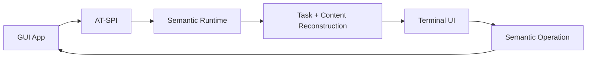

<p align="center">
  
</p>

# GUI2TUI

**Turn Linux GUI semantics and verified capabilities into responsive terminal-native workflows.**

GUI2TUI recompiles accessibility-exposed application semantics, spatial
topology, and trustworthy operations into an interactive TUI — not pixels into
ASCII.

[](https://github.com/Chenhzjs/GUI2TUI/releases/latest)
[](https://github.com/Chenhzjs/GUI2TUI/actions/workflows/ci.yml)


[](#license)

> **Semantics, not screenshots.** Controls become terminal tasks, documents
> become a Reader, and unavailable semantics degrade safely instead of being
> guessed.

## See it in action


This is a real v0.3 workflow: GUI2TUI adjusts a bounded Value through public
AT-SPI and shows the fresh authoritative result. Complex plain text can use a
configured local handler without turning that program—or an application
backing file—into the semantic backend.

[Watch the 32-second v0.3 hero demo](docs/demo/v0.3/hero-v0.3.mp4)
· [Full capability and refusal demo](docs/demo/v0.3/demo-v0.3.mp4)
· [Recording method and evidence](docs/demo/v0.3/README.md)

## Download and quick start

The current source is prepared as the v0.3.0 release candidate. Responsive
spatial presentation remains the default; `--layout flat` remains a
compatibility fallback. Public v0.3.0 release publication is a separate step.

```bash
git clone https://github.com/Chenhzjs/GUI2TUI.git
cd GUI2TUI
cargo build --release

./target/release/gui2tui doctor
./target/release/gui2tui
```

The GUI application must already be running in a Linux desktop session whose
AT-SPI bus is reachable. The terminal itself may be headless or connected over
SSH to that same host. No config file, root privilege, full desktop environment,
or companion viewer is required.

For a server without a physical desktop, configure a persistent managed Xvfb +
D-Bus + AT-SPI session once:

```bash
./bin/gui2tui setup persistent
```

Every later terminal for the same user automatically uses it; no shell profile,
`source`, or extra helper command is required. Use `setup status`, `restart`, or
`stop` to manage it. An isolated one-shell alternative is
`gui2tui setup temporary`.

To save and launch an application directly (instead of starting it in another
shell first), register its executable once. The shortest form is:

```bash
./bin/gui2tui app add mousepad
./bin/gui2tui launch mousepad
```

Run `./bin/gui2tui app add` with no executable for a fill-in setup wizard. For
ordinary applications, type the executable and press Enter once more to finish
the optional argument list; names are inferred/discovered automatically.
If Chromium does not register accessibility by default, add its required argv
without a shell command:

```bash
./bin/gui2tui app add chromium --replace -- \
  --force-renderer-accessibility=complete about:blank
```

Registered applications also appear as `[launch]` entries in the normal
`gui2tui` selector; already accessible applications appear as `[running]`.

On the first successful launch, GUI2TUI learns and saves the real AT-SPI name;
for example, `libreoffice` resolves to `soffice`. Strict Snap applications
cannot reach a private managed D-Bus due to confinement; that topology is
now rejected immediately. Use the normal desktop session or a non-Snap build,
never a weakened sandbox. See [launcher compatibility](docs/launcher-compatibility.md).

Verify downloaded archives with:

```bash
sha256sum -c SHA256SUMS
```

See [Getting started](docs/getting-started.md) for installation details and
[build provenance verification](docs/release-pipeline.md) for GitHub attestations.

## What is GUI2TUI?

```text
GUI application
      ↓
AT-SPI semantics + spatial evidence
      ↓
Semantic graph + spatial topology
      ↓
Region presentation + responsive composition
      ↓
Terminal-native tasks and content
```

GUI2TUI is not a framebuffer-to-ASCII converter, remote desktop, or GUI layout
emulator. It reorganizes exposed roles, relations, state and safe operations for
a terminal: buttons remain actions, choices become terminal selectors, and
document-like content becomes a reflowed Reader.

v0.1 established semantic GUI → terminal workflows. v0.2 added generic spatial
reconstruction and responsive composition. v0.3 adds verified capability
recovery: GUI2TUI exposes mutation only when public semantics, current identity,
safe invocation, and authoritative read-back make it trustworthy. Coverage
still depends on what each application exposes through Linux Accessibility /
AT-SPI.

## v0.2 navigation

The terminal-generated Region Navigator is distinct from GUI TabList semantics:

```text
F6 / Shift+F6       major region
Ctrl+Tab             sibling pane
Ctrl+Shift+Tab       previous sibling pane
Tab / Shift+Tab      control in the active pane
```

Depending on terminal space, regions may split, stack, collapse, summarize or
move into navigation. At most two useful navigation levels are shown; missing
or unreliable accessibility data degrades safely.

## What works in v0.3

- Application discovery, saved launchers and terminal application selector
- Buttons, checkboxes, choices, menus and semantic command palette
- Safe atomic editing of qualified plain single-line text fields
- Native adjustment of qualified bounded Slider/SpinButton-style Values
- Optional configured interaction for complete, bounded, non-secret multiline
  plain text, with conflict checks and public AT-SPI write-back
- Reader, Outline and bounded semantic Search
- Tables and explicitly partial/virtualized collections
- Event-driven updates with fast AT-SPI Cache bootstrap and correctness fallback
- Keyboard and terminal-mouse operation
- Headless operation and optional same-host modality viewer
- Reference-first external resources and explicit static visual snapshots
- GTK, Qt, Chromium, Firefox and LibreOffice representative workflows
- Responsive spatial composition and hierarchical region navigation

The original GUI always remains authoritative. Setter/process success alone is
not presented as success; GUI2TUI independently reads the resulting GUI state.
Progress/status Values, incomplete or rich documents, passwords, anonymous
actions, and unverified writes remain read-only or unavailable by design.

## Examples from real GUI applications

The following are shortened exports from real Linux AT-SPI sessions, not UI
mockups. GUI2TUI reorganizes the exposed semantics instead of copying the GUI's
pixel layout.

### v0.2 spatial scenes

These captures are real accessibility-backed v0.2 scenes (not mockups):

| Application | Representative scene |
| --- | --- |
| Chromium | [responsive document + address/search surface](docs/validation/v0.2/terminal-ux/chromium-normal.png) |
| Qt Designer | [hierarchical Region Navigator](docs/validation/v0.2/terminal-ux/qt-designer-wide.png) |
| EOG | [graphical content + compact controls](docs/validation/v0.2/terminal-ux/eog-normal.png) |
| Mousepad | [document-centered normal scene](docs/validation/v0.2/terminal-ux/mousepad-normal.png) |

### Chrome and Firefox: web page → Reader, outline and search

A normal browser page with headings, links, form controls and tables becomes a
bounded document task:

```text
┌ GUI2TUI — GUI2TUI Browser Fixture - Google Chrome ───────┐
│> Document: GUI2TUI Browser Fixture                       │
│    114 blocks | 4 headings | 3 links | 18 forms          │
│    completeness: Complete                                │
│    [ Enter: Read document ]                              │
│    o Outline | / Content search                          │
└──────────────────────────────────────────────────────────┘

┌ Reader — GUI2TUI Browser Fixture ────────────────────────┐
│ # Semantic architecture                                 │
│ GUI2TUI turns accessibility semantics into               │
│ terminal-native tasks and readable content.              │
│ [Link] Architecture                                      │
│ [Link] Evaluation                                        │
└──────────────────────────────────────────────────────────┘
```

Chrome and Firefox both completed Reader, Outline, Search and semantic-table
workflows. This path uses AT-SPI only—no DOM/CDP or browser-specific adapter.


### LibreOffice Writer: document canvas → reflowed content

Writer content is presented as headings and semantic blocks rather than a
terminal copy of the page canvas:

```text
┌ Reader — LibreOffice Writer — partial ───────────────────┐
│ # GUI2TUI Semantic Content                               │
│ This document is read through AT-SPI only.                │
│ # Architecture                                           │
│ • Controls remain task-oriented.                         │
│ • Paragraphs are progressively materialized.             │
└──────────────────────────────────────────────────────────┘
```

GUI2TUI does not parse ODT or use UNO. If Writer exposes only the realized
portion of a long document, the Reader says `partial` instead of claiming full
document coverage.

### GTK and Qt applications: controls → terminal tasks

Mousepad multiline content becomes a Reader. Qt Designer choices, commands and
dialogs remain navigable. Controlled GTK/Qt applications additionally validate
safe text editing, choices, checkboxes and authoritative action read-back:

```text
┌ GUI2TUI — Qt form ────────────────────────────────────────┐
│ Username: alice                                          │
│ Password: [password]  (read-only)                        │
│ [x] Enable feature                                       │
│> [ Theme: Light ▼ ]                                      │
│ [ Choice: Beta ▼ ]                                       │
│ [ Activate safely ]                                      │
└──────────────────────────────────────────────────────────┘
```

In the recorded GTK workflow, activating a TUI button changed the checkbox and
status in the original GUI; GUI2TUI then refreshed from AT-SPI rather than
changing local state optimistically.


[See the full collection of real GUI → TUI exports](docs/gui-to-tui-examples.md),
including browser tables, Writer, GTK rich text, Qt Choice overlays and static
visual modality.

### Safe degradation is a feature

When accessibility information is incomplete, GUI2TUI does not guess:

- anonymous action → refused;
- partially exposed document → clearly marked `PartialRealized`;
- unresolved visual resource → unavailable rather than fabricated;
- stale backend object → rejected instead of reusing an old identity.

## How it works



The original GUI remains the source of truth. GUI2TUI sends only resolved,
advertised semantic operations, then confirms resulting state through AT-SPI
events or bounded read-back. Geometry is not the primary terminal layout.

See [Architecture](docs/architecture.md), [Design principles](docs/design-principles.md),
and the [semantic contract](docs/semantic-contract.md) for the technical model.

## Real-world validation

| Family | Validated example | Current result |
| --- | --- | --- |
| GTK | Mousepad, controlled GTK fixtures | Native text and configured complete-text workflows validated |
| Qt | Qt Designer, controlled Qt fixtures | Spatial workflows and bounded Value validated; unsafe multiline Text remains quarantined |
| Chromium | Google Chrome | Validated Reader/table/search workflows |
| Firefox | Mozilla Firefox | Validated Reader/table/search workflows |
| LibreOffice | Writer | Validated; long documents may be partial |
| Electron | Visual Studio Code | Partial, accessibility-dependent |

These are bounded workflow claims, not promises that every control in every
application is supported. See the detailed [compatibility matrix](docs/compatibility.md)
and [Phase 4C evidence](docs/phase4c-validation.md).

## Known limitations

- Large Chromium trees may need several seconds while the accessibility Cache
  is incomplete and GUI2TUI performs a correctness walk.
- Long documents may expose only the currently realized semantic subset.
- Electron coverage depends heavily on each application's accessibility tree.
- External editing is limited to qualified complete, bounded, non-secret plain
  text. Rich, partial, virtualized and quarantined text remains read-only.
- Configured handlers must preserve GUI2TUI's owned artifact identity; editor
  compatibility is not universal. No editor is required for normal startup.
- Password editing/export, broad Selection recovery, generic Expand/Collapse,
  IME, clipboard and remote-caret editing are not implemented.
- Wayland static image acquisition is not implemented.
- Remote companion transport and new-TTY attachment are not implemented.
- Live game, video and 3D surfaces are not streamed.

See [Limitations](docs/limitations.md) for exact safety boundaries.

## Documentation

- [Getting started](docs/getting-started.md)
- [Configuration](docs/configuration.md)
- [Deployment: headless and same-host](docs/deployment.md)
- [Troubleshooting and contents-free diagnostics](docs/troubleshooting.md)
- [Inspector reference](docs/inspector.md)
- [Architecture](docs/architecture.md)
- [Development and live-test harnesses](docs/development.md)
- [Project history](docs/history.md)
- [v0.3.0 release notes](docs/release-notes-v0.3.0.md)
- [v0.2.0 release notes](docs/release-notes-v0.2.0.md)
- [Unreleased corrective notes for v0.1.2](docs/release-notes-v0.1.2.md)
- [Release notes for v0.1.1](docs/release-notes-v0.1.1.md)
- [Launcher compatibility and failure classes](docs/launcher-compatibility.md)
- [Release notes for v0.1.0](docs/release-notes-v0.1.0.md)
- [v0.1.0 public release verification](docs/release-v0.1.0-validation.md)

## Development

macOS can build and test the code, but live AT-SPI operation requires Linux.
Rust 1.88 or newer is supported.

```bash
cargo build --locked
cargo test --all-targets --locked
```

The Rust backend talks to AT-SPI over D-Bus through `zbus`; it does not link to
GTK, Qt or `libatspi`. See [Development](docs/development.md) for fixtures,
Xvfb/browser probes, release packaging and the reproducible demo recorder.

## Current boundaries

- Accessibility completeness and operation quality remain application-defined.
- Rich-text fidelity, broad Selection and generic Expand/Collapse recovery are
  intentionally outside v0.3.
- Remote modality transport, Wayland static capture, and live visual streaming
  remain future work.

## License

GUI2TUI is available under either:

- [Apache License 2.0](LICENSE-APACHE), or
- [MIT License](LICENSE-MIT),

at your option.
