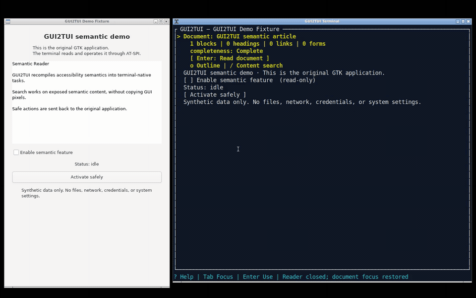
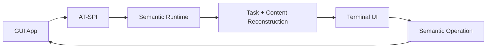

<p align="center">
  
</p>

# GUI2TUI

**Turn Linux GUI semantics into terminal-native workflows.**

GUI2TUI recompiles accessibility-exposed application semantics into an
interactive TUI - not pixels into ASCII.

[](https://github.com/Chenhzjs/GUI2TUI/releases/latest)
[](https://github.com/Chenhzjs/GUI2TUI/actions/workflows/ci.yml)


[](#license)

> **Semantics, not screenshots.** Controls become terminal tasks, documents
> become a Reader, and unavailable semantics degrade safely instead of being
> guessed.

## See it in action



This is a real 60-second GTK/AT-SPI/GUI2TUI recording. The terminal opens
semantic content in Reader, searches it, then invokes a named action; the
checkbox and status in the original GUI change authoritatively.

[Watch the full 60-second demo](https://github.com/Chenhzjs/GUI2TUI/releases/download/v0.1.0/gui2tui-v0.1-demo.mp4)
· [Recording method and text walkthrough](docs/demo/README.md)
· [More real GUI-to-TUI frames](docs/gui-to-tui-examples.md)

## Download and quick start

Download **[GUI2TUI v0.1.0](https://github.com/Chenhzjs/GUI2TUI/releases/tag/v0.1.0)**
for Linux `x86_64` or `aarch64`, then:

```bash
tar -xzf gui2tui-0.1.0-linux-x86_64.tar.gz
cd gui2tui-0.1.0-linux-x86_64

./bin/gui2tui doctor
./bin/gui2tui
```

The GUI application must already be running in a Linux desktop session whose
AT-SPI bus is reachable. The terminal itself may be headless or connected over
SSH to that same host. No config file, root privilege, full desktop environment,
or companion viewer is required.

Verify downloaded archives with:

```bash
sha256sum -c SHA256SUMS
```

See [Getting started](docs/getting-started.md) for installation details and
[build provenance verification](docs/release-pipeline.md) for GitHub attestations.

## What is GUI2TUI?

```text
GUI application
      ↓
AT-SPI accessibility semantics
      ↓
GUI2TUI semantic runtime
      ↓
Terminal-native tasks and content
```

GUI2TUI is not a framebuffer-to-ASCII converter, remote desktop, or GUI layout
emulator. It reorganizes exposed roles, relations, state and safe operations for
a terminal: buttons remain actions, choices become terminal selectors, and
document-like content becomes a reflowed Reader.

GUI2TUI v0.1 provides terminal-native interaction for Linux GUI applications
that expose usable AT-SPI accessibility semantics. Coverage depends on the
accessibility information exposed by each application.

## What works in v0.1

- Application discovery and terminal application selector
- Buttons, checkboxes, choices, menus and semantic command palette
- Safe atomic editing of plain single-line text fields
- Reader, Outline and bounded semantic Search
- Tables and explicitly partial/virtualized collections
- Event-driven updates with fast AT-SPI Cache bootstrap and correctness fallback
- Keyboard and terminal-mouse operation
- Headless operation and optional same-host modality viewer
- Reference-first external resources and explicit static visual snapshots
- GTK, Qt, Chromium, Firefox and LibreOffice representative workflows

## Examples from real GUI applications

The following are shortened exports from real Linux AT-SPI sessions, not UI
mockups. GUI2TUI reorganizes the exposed semantics instead of copying the GUI's
pixel layout.

### Chrome and Firefox: web page → Reader, outline and search

A normal browser page with headings, links, form controls and tables becomes a
bounded document task:

```text
┌ GUI2TUI — GUI2TUI Browser Fixture - Google Chrome ───────┐
│> Document: GUI2TUI Browser Fixture                       │
│    114 blocks | 4 headings | 3 links | 18 forms          │
│    completeness: Complete                                │
│    [ Enter: Read document ]                              │
│    o Outline | / Content search                          │
└──────────────────────────────────────────────────────────┘

┌ Reader — GUI2TUI Browser Fixture ────────────────────────┐
│ # Semantic architecture                                 │
│ GUI2TUI turns accessibility semantics into               │
│ terminal-native tasks and readable content.              │
│ [Link] Architecture                                      │
│ [Link] Evaluation                                        │
└──────────────────────────────────────────────────────────┘
```

Chrome and Firefox both completed Reader, Outline, Search and semantic-table
workflows. This path uses AT-SPI only—no DOM/CDP or browser-specific adapter.


### LibreOffice Writer: document canvas → reflowed content

Writer content is presented as headings and semantic blocks rather than a
terminal copy of the page canvas:

```text
┌ Reader — LibreOffice Writer — partial ───────────────────┐
│ # GUI2TUI Semantic Content                               │
│ This document is read through AT-SPI only.                │
│ # Architecture                                           │
│ • Controls remain task-oriented.                         │
│ • Paragraphs are progressively materialized.             │
└──────────────────────────────────────────────────────────┘
```

GUI2TUI does not parse ODT or use UNO. If Writer exposes only the realized
portion of a long document, the Reader says `partial` instead of claiming full
document coverage.

### GTK and Qt applications: controls → terminal tasks

Mousepad multiline content becomes a Reader. Qt Designer choices, commands and
dialogs remain navigable. Controlled GTK/Qt applications additionally validate
safe text editing, choices, checkboxes and authoritative action read-back:

```text
┌ GUI2TUI — Qt form ────────────────────────────────────────┐
│ Username: alice                                          │
│ Password: [password]  (read-only)                        │
│ [x] Enable feature                                       │
│> [ Theme: Light ▼ ]                                      │
│ [ Choice: Beta ▼ ]                                       │
│ [ Activate safely ]                                      │
└──────────────────────────────────────────────────────────┘
```

In the recorded GTK workflow, activating a TUI button changed the checkbox and
status in the original GUI; GUI2TUI then refreshed from AT-SPI rather than
changing local state optimistically.


[See the full collection of real GUI → TUI exports](docs/gui-to-tui-examples.md),
including browser tables, Writer, GTK rich text, Qt Choice overlays and static
visual modality.

### Safe degradation is a feature

When accessibility information is incomplete, GUI2TUI does not guess:

- anonymous action → refused;
- partially exposed document → clearly marked `PartialRealized`;
- unresolved visual resource → unavailable rather than fabricated;
- stale backend object → rejected instead of reusing an old identity.

## How it works



The original GUI remains the source of truth. GUI2TUI sends only resolved,
advertised semantic operations, then confirms resulting state through AT-SPI
events or bounded read-back. Geometry is not the primary terminal layout.

See [Architecture](docs/architecture.md), [Design principles](docs/design-principles.md),
and the [semantic contract](docs/semantic-contract.md) for the technical model.

## Real-world validation

| Family | Validated example | v0.1 result |
| --- | --- | --- |
| GTK | Mousepad, controlled GTK fixtures | Validated workflows |
| Qt | Qt Designer, controlled Qt fixtures | Validated workflows |
| Chromium | Google Chrome | Validated Reader/table/search workflows |
| Firefox | Mozilla Firefox | Validated Reader/table/search workflows |
| LibreOffice | Writer | Validated; long documents may be partial |
| Electron | Visual Studio Code | Partial, accessibility-dependent |

These are bounded workflow claims, not promises that every control in every
application is supported. See the detailed [compatibility matrix](docs/compatibility.md)
and [Phase 4C evidence](docs/phase4c-validation.md).

## v0.1 limitations

- Large Chromium trees may need several seconds while the accessibility Cache
  is incomplete and GUI2TUI performs a correctness walk.
- Long documents may expose only the currently realized semantic subset.
- Electron coverage depends heavily on each application's accessibility tree.
- Multiline/rich-text, password, IME, clipboard and remote-caret editing are not
  implemented; document text remains readable through Reader where exposed.
- Wayland static image acquisition is not implemented.
- Remote companion transport and new-TTY attachment are not implemented.
- Live game, video and 3D surfaces are not streamed.

See [Limitations](docs/limitations.md) for exact safety boundaries.

## Documentation

- [Getting started](docs/getting-started.md)
- [Configuration](docs/configuration.md)
- [Deployment: headless and same-host](docs/deployment.md)
- [Troubleshooting and contents-free diagnostics](docs/troubleshooting.md)
- [Inspector reference](docs/inspector.md)
- [Architecture](docs/architecture.md)
- [Development and live-test harnesses](docs/development.md)
- [Project history](docs/history.md)
- [Release notes for v0.1.0](docs/release-notes-v0.1.0.md)
- [v0.1.0 public release verification](docs/release-v0.1.0-validation.md)

## Development

macOS can build and test the code, but live AT-SPI operation requires Linux.
Rust 1.88 or newer is supported.

```bash
cargo build --locked
cargo test --all-targets --locked
```

The Rust backend talks to AT-SPI over D-Bus through `zbus`; it does not link to
GTK, Qt or `libatspi`. See [Development](docs/development.md) for fixtures,
Xvfb/browser probes, release packaging and the reproducible demo recorder.

## Beyond v0.1

- broader compatibility validation;
- improved accessibility-cache readiness;
- optional remote modality transport;
- additional static acquisition providers;
- product UX, packaging and maintenance.

## License

GUI2TUI is available under either:

- [Apache License 2.0](LICENSE-APACHE), or
- [MIT License](LICENSE-MIT),

at your option.
