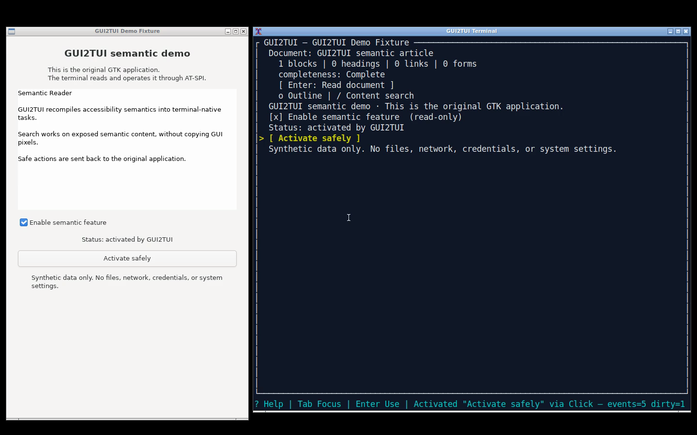
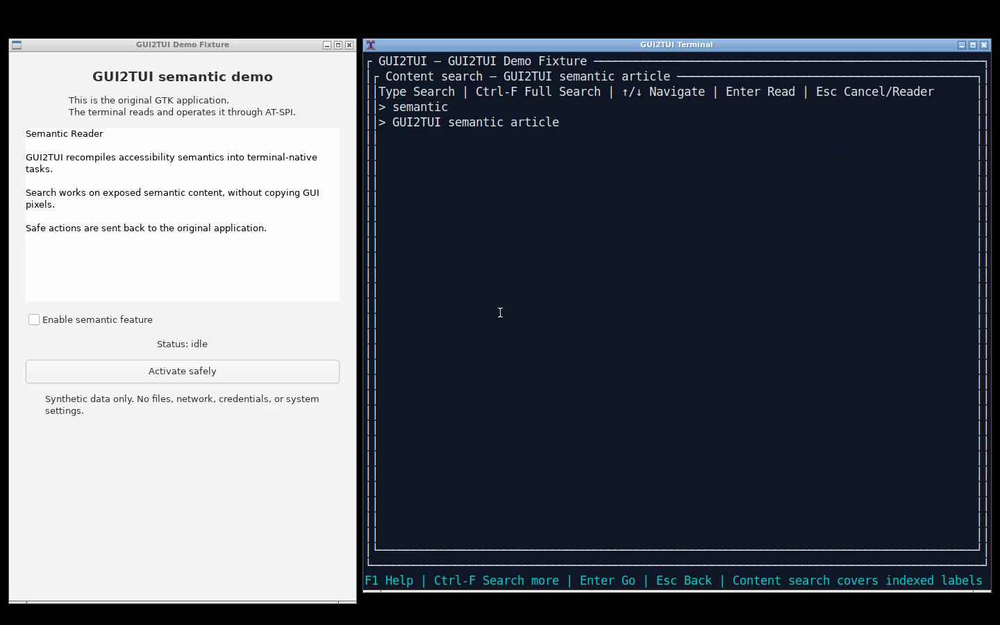

<p align="center">
  
</p>

# GUI2TUI

**Operate Linux GUI applications from a terminal when they expose sufficient
public Accessibility semantics.**

GUI2TUI recompiles GUI application semantics, capabilities and useful spatial
relationships into a terminal-native interface. It does not stream pixels or
map screen coordinates to terminal cells.

[](https://github.com/Chenhzjs/GUI2TUI/releases/latest)
[](https://github.com/Chenhzjs/GUI2TUI/actions/workflows/ci.yml)
[](#license)

## Why GUI2TUI?

You may have access to a Linux terminal, container terminal or SSH session
while the application you need to use is graphical. GUI2TUI keeps the original
GUI authoritative and presents the application's exposed meaning as a TUI:

```text
GUI application
      ↓
public AT-SPI Accessibility semantics
      ↓
GUI2TUI semantic runtime
      ↓
terminal-native views and operations
      ↓
authoritative GUI state/readback
```

The Headless-first path does not require the user to operate GNOME, KDE, VNC
or a physical display. The GUI application may still need a background Xvfb,
session D-Bus or qualified Wayland compositor on the same host.

## What you can do

The v1.0 baseline remains supported. The v1.1 line adds a richer semantic
Surface and keeps user-visible operations tied to fresh authoritative GUI
state. The current v1.1 release candidate adds:

- discover and explicitly select accessible applications;
- navigate responsive terminal-native scenes, forms and controls;
- operate buttons, toggles, values, single selection, table rows, tabs and
  qualified hierarchies;
- use menus, modal dialogs, Open File and Choose Folder where the application
  exposes verifiable public semantics;
- read document/content regions through Reader, outline and bounded search;
- edit qualified single-line text and complete, bounded, non-secret plain text
  through an optional local handler;
- follow dynamic UI changes and continue manually from the fresh scene;
- reject stale targets and report unsupported semantics instead of guessing.
- preserve application-shell regions alongside document/content regions;
- keep Surface context separate from the explicit Reader projection;
- verify text edits by authoritative Accessibility readback before accepting
  them;
- expose `Send Enter to current control` as an explicit, low-level raw-input
  capability. It is never silently used as Semantic Submit.

## What it is not

GUI2TUI is not a remote desktop, framebuffer-to-ASCII converter, OCR system,
coordinate-clicking tool, arbitrary automation or application-specific
scripting framework. It does not use DOM/CDP, UNO, private toolkit APIs or
backing-file mutation to manufacture capability. A narrowly bounded native
keyboard backend exists for an explicit Raw Enter intent on a freshly verified
X11 target; key delivery is not semantic authority or proof of success.

## Quick start

For the stable public baseline, download the appropriate archive from the
[GUI2TUI v1.0.0 release](https://github.com/Chenhzjs/GUI2TUI/releases/tag/v1.0.0).
The v1.1.0-rc.1 archives are internal qualification artifacts and are not
published by this branch.
The archives are named for the target reported by `uname -m`:

```bash
ARCH="$(uname -m)"       # x86_64 or aarch64
curl -LO "https://github.com/Chenhzjs/GUI2TUI/releases/download/v1.0.0/gui2tui-1.0.0-linux-${ARCH}.tar.gz"
tar -xzf "gui2tui-1.0.0-linux-${ARCH}.tar.gz"
cd "gui2tui-1.0.0-linux-${ARCH}"
./install-user.sh --prefix "$HOME/.local"
export PATH="$HOME/.local/bin:$PATH"
gui2tui --version
```

Verify a downloaded archive with the release `SHA256SUMS` before installing.
The installer is unprivileged and deliberately refuses to overwrite existing
targets. For replacement or custom prefixes, see
[Getting started](docs/getting-started.md).

### Start a Managed headless session

On a host without a user-operated graphical desktop:

```bash
gui2tui setup persistent
gui2tui --session managed doctor
gui2tui --session managed
```

The target GUI application must run inside the same selected graphical and
Accessibility session. If it is already running, select it in the application
list. If it is installed and can be launched directly, register it and let
GUI2TUI start it in the Managed session:

```bash
gui2tui --session managed app add mousepad
gui2tui --session managed launch mousepad
gui2tui --session managed
```

The launcher passes arguments directly without a shell. It cannot create an
Accessibility tree for an application that does not expose one. Use
`gui2tui setup status`, `restart` and `stop` to manage the session.

### Use the TUI

The selector accepts arrows, Enter and `/` for filtering. In a scene, use
Tab/Shift-Tab and the arrow keys to move through available semantic controls;
Enter invokes the currently advertised operation. `F1` or `?` opens contextual
help, `F5` refreshes/reconnects where applicable, `:` opens scoped commands,
and `q` or Ctrl-C exits while restoring the terminal.

For the complete first-use path, external text configuration, Docker and SSH
examples, read [Getting started](docs/getting-started.md) and
[Deployment](docs/deployment.md).

## Real demonstrations

These repository assets are real accessibility-backed GUI/TUI captures, not
mockups:

### Semantic action with authoritative result

The original GTK fixture and the terminal show the same public semantic action
and resulting state:



### Reader and content search (read-only)

An exposed document is reorganized as a terminal Reader; search operates on
the available semantic content. This is intentionally a read-only frame: the
checkbox on the left remains `idle` because searching does not mutate the GUI.
The corresponding GUI-to-TUI state-changing operation is shown above.



### End-to-end semantic scene

This capture shows the original GUI beside the terminal-native scene, including
an exposed action and status readback:


For the reproducible GTK fixture walkthrough, recording method and result
files, see [demo assets](docs/demo/README.md). The older Value and external-text
recordings remain useful demonstrations of the same v1.0 safety contracts;
their historical provenance is retained under [docs/demo/v0.3](docs/demo/v0.3/README.md):
[short walkthrough](docs/demo/v0.3/hero-v0.3.mp4) and
[full safety/refusal walkthrough](docs/demo/v0.3/demo-v0.3.mp4).

## Supported environments

GUI2TUI v1.1 is Headless-first. The qualified support contract includes:

- Managed Xvfb sessions;
- the recorded unprivileged Docker/OCI interactive-PTY topology;
- same-host SSH into a Managed session;
- the recorded Weston headless Native Wayland/XWayland topology, with explicit
  limitations;
- native Linux aarch64 package and live evidence;
- semantic operations on the recorded headless Wayland/XWayland topology;
- Raw Enter only where the qualified X11 NativeInputBackend can activate and
  verify the exact target window and Accessibility focus.

Linux x86_64 packages are available and ABI/install/runtime-smoke qualified
through amd64 emulation on an arm64 host. Native x86_64 hardware and a full
native environment matrix are not qualified. Linux native VT, ordinary local
desktop sessions, Wayland over SSH, static capture and cross-host Remote
Companion are not v1.1 support claims.

See the [v1.1 support matrix](docs/validation/v1.1/final-support-matrix.md)
for exact topology, architecture and capability boundaries. The v1.0 matrix
remains historical release evidence.

## Safety and correctness

GUI2TUI acts only on currently exposed public Accessibility semantics. A
successful backend method or event does not by itself prove success; writes
require fresh authoritative application readback. Stale targets, replaced
applications and invalid scopes are rejected. PasswordText is never exported,
external text handlers receive only private GUI2TUI-owned candidates, and
unsupported or incomplete semantics degrade to read-only or an explicit refusal.

## Limitations

Accessibility quality is application-defined. Not every control exposes a
safe operation, and some Qt transient choice shapes do not expose reliable
selected/current truth. Rich-text fidelity, arbitrary drag/drop, exhaustive
virtualization, pointer-only interactions and private application semantics
are outside the v1.1 task contract. Native Raw Enter is currently X11/XTEST-only;
native text fallback is limited to its documented character set; mouse
injection, coordinate clicking, arbitrary key scripting and uinput remain
unsupported. Long documents and virtualized content may remain partial. See
[current limitations](docs/limitations.md) for safe recovery guidance.

## Documentation

- [Getting started](docs/getting-started.md)
- [Deployment and supported topologies](docs/deployment.md)
- [Limitations and support boundaries](docs/limitations.md)
- [Troubleshooting](docs/troubleshooting.md)
- [Architecture](docs/architecture.md)
- [Engineering guide](docs/project-guide.md)
- [v1.1 release notes](docs/release-notes-v1.1.0.md)
- [v1.1 support matrix](docs/validation/v1.1/final-support-matrix.md)
- [v1.0 release notes](docs/release-notes-v1.0.0.md)
- [Release verification](docs/validation/v1.0/final-release/HANDOFF.md)
- [Development and validation history](docs/history.md)

## Development

Builds and tests require Rust 1.88 or newer. Live AT-SPI operation requires
Linux; macOS can build and run non-live checks.

```bash
cargo build --locked
cargo test --all-targets --locked
```

GUI2TUI reached v1.0 through internal architecture and validation milestones.
Historical evidence remains under `docs/validation/` and the planning
documents; it is provenance, not additional user setup.

## License

GUI2TUI is available under either:

- [Apache License 2.0](LICENSE-APACHE), or
- [MIT License](LICENSE-MIT),

at your option.
