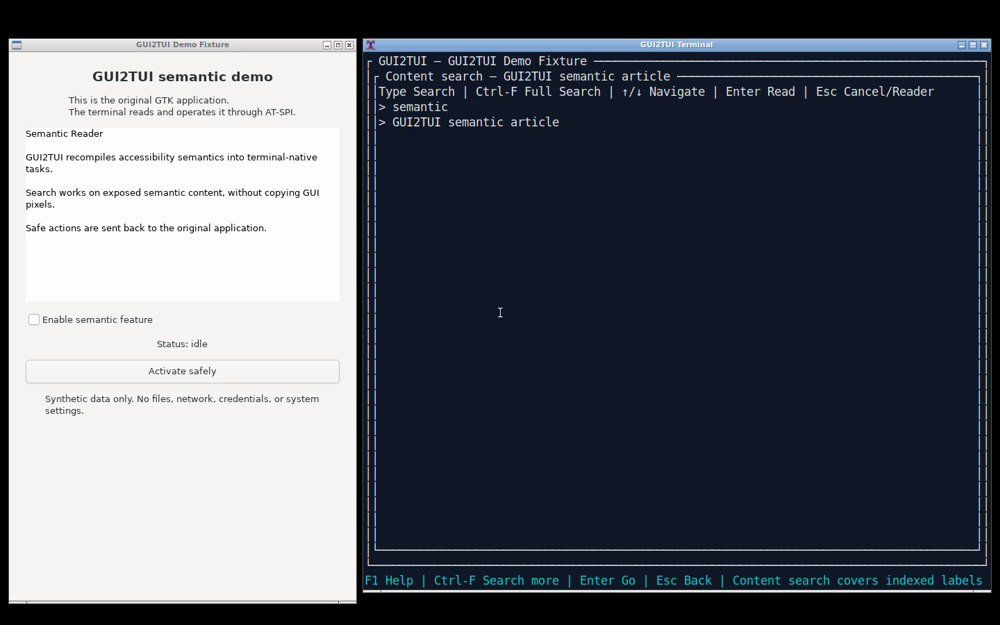
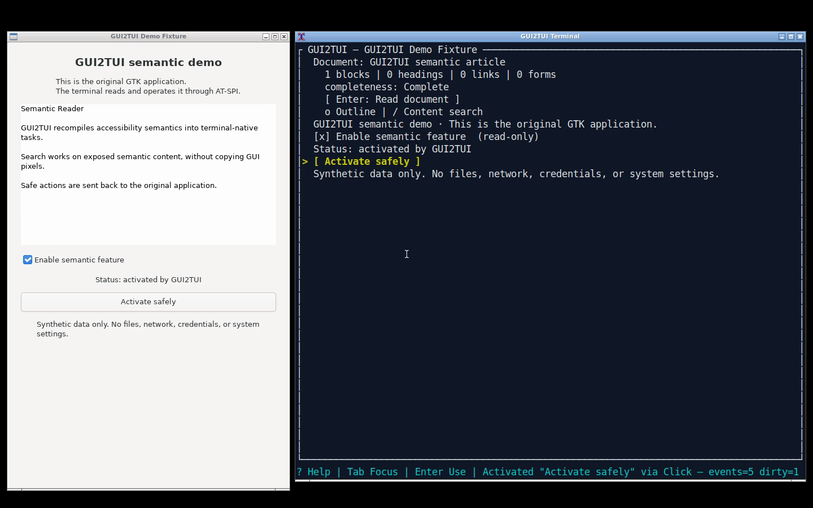

# GUI2TUI demo assets

The repository contains a real split-screen recording of the GTK demo fixture
and GUI2TUI terminal runtime, plus v0.2 spatial scene captures. The recording
is retained as a semantic-operation walkthrough; the README hero now uses a
fresh v0.2 Qt Designer scene so the primary public presentation does not show
obsolete flat-layout UX.

## Reproduce

On an isolated Debian/Ubuntu graphical test host, install the recording-only
tools (`ffmpeg`, `xterm`, `openbox`, `xdotool`, `wmctrl`, and `xvfb`), then:

```bash
cargo build --release --locked
OUTPUT_DIR=/tmp/gui2tui-demo scripts/demo/record.sh
```

The script creates a private HOME, XDG runtime, D-Bus session, AT-SPI service,
and Xvfb display. It records one 1440x900 H.264 frame stream and derives a small
PNG/GIF preview. These tools are not GUI2TUI runtime dependencies.

## Walkthrough

1. `gui2tui doctor` verifies the isolated accessibility session.
2. The application selector filters to `GUI2TUI Demo Fixture`.
3. Reader reflows a real read-only GTK Text object.
4. Search finds `semantic` in exposed content.
5. The command palette resolves `Activate safely`.
6. The named AT-SPI action changes the original GTK checkbox and status label.

## Captured frames

Reader and semantic search (semantic-operation walkthrough):



Authoritative action confirmation in both the original GUI and TUI:



Only synthetic text is used. The script deletes its private session directory
on exit. The full MP4 is a GitHub Release asset rather than a Git-tracked file.
Exact capture dimensions, hashes and the production source boundary are recorded
in [`recording.json`](recording.json).

For v0.2 spatial examples, see the real captures under
`docs/validation/v0.2/terminal-ux/` and the links in the README. They show
responsive composition and Region Navigator behavior without fabricated UI.
