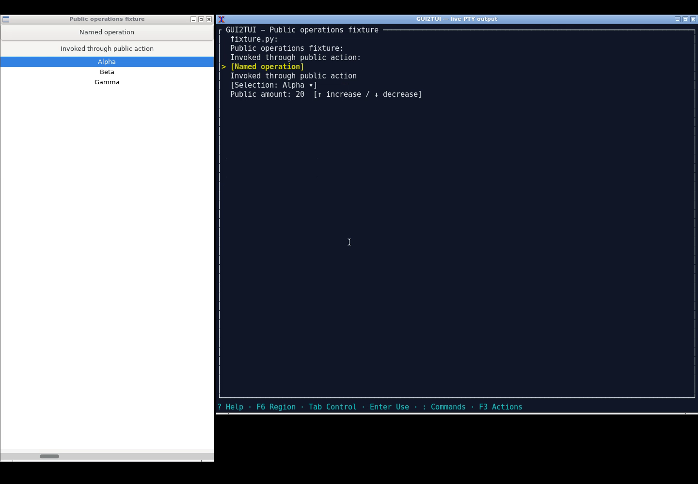

# 当前开发分支操作视频

三个视频均为实际 X11 录屏，左侧原 GUI，右侧实际 GUI2TUI PTY 输出的实时镜像。
镜像由 xterm 显示原始终端字节，不是重绘的模拟界面。输入仅送往 GUI2TUI PTY；
Python 不直接调用 GUI 的 Action、EditableText 或 Selection 写接口。
录屏是展示产物，屏幕图像不参与生产语义识别或操作。

| 视频 | 实际操作 | 结果 |
|---|---|---|
| [公开操作与多选](fixture/operations.mp4) | F3 click；添加 Alpha/Beta；移除 Alpha；Value 20→25 | 四项断言通过 |
| [Firefox 地址跳转](firefox/operations.mp4) | 编辑地址栏，提交文本，显式 Raw Enter，跳转本地 data 页面 | 目标文档标题确认 |
| [Mousepad 新建与编辑](mousepad/operations.mp4) | 新建文档；全文编辑；通过 EditableText 提交 | 新标签及精确文本确认 |

Mousepad 使用测试配置的确定性本地文本 handler 写 GUI2TUI 临时副本，随后由
GUI2TUI 提交给应用；不是直接改应用文件，也不是手工敲字演示。实际使用可配置
vim 等编辑器。Firefox 使用离线 data URL，不依赖公网。视频无剪辑、无配音，
录制包含正常等待时间，布局选 flat 以便观看操作。

每个目录的 result.json 保留独立只读断言、终端步骤与二进制哈希。
recording.json 记录源码提交、镜像、视频时长和 SHA-256。不是完整 benchmark
或发布资格证明；没有更改 release 或 tag。

## 复现

在仓库根目录构建 Linux gui2tui，放在 target/autonomous-linux/debug/gui2tui。
基础测试镜像构建方式见 tests/research/benchmark/Dockerfile.tasks，然后执行：

    docker build --platform linux/amd64 -t gui2tui-recording:local -f scripts/demo/Dockerfile.public-operations .
    mkdir -p /tmp/gui2tui-recording
    docker run --rm --platform linux/amd64 --network none       -v "$PWD:/work:ro"       -v "$PWD/tests/research/benchmark/public_operations_fixture.py:/fixture.py:ro"       -v /tmp/gui2tui-recording:/evidence       --entrypoint dbus-run-session gui2tui-recording:local --       python3 /work/scripts/demo/record-public-operations.py fixture --scenario exercise       --binary /work/target/autonomous-linux/debug/gui2tui --output /evidence

另两个片段分别换成 firefox --scenario address_navigate 和 mousepad --scenario new，
并使用不同输出目录。录制脚本需要 ffmpeg、xterm、wmctrl，均仅用于开发录制。

操作入口、按键、资源预算及错误含义见 [操作指南](../../public-operations.md)。
