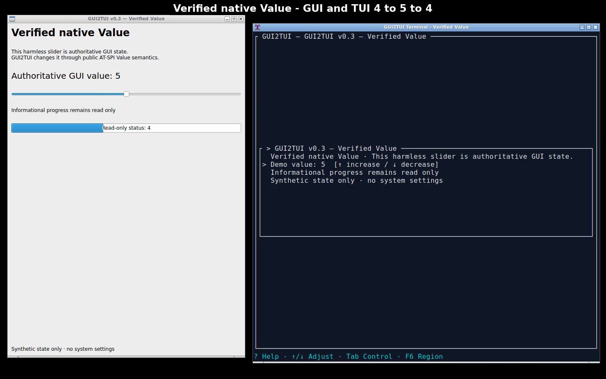
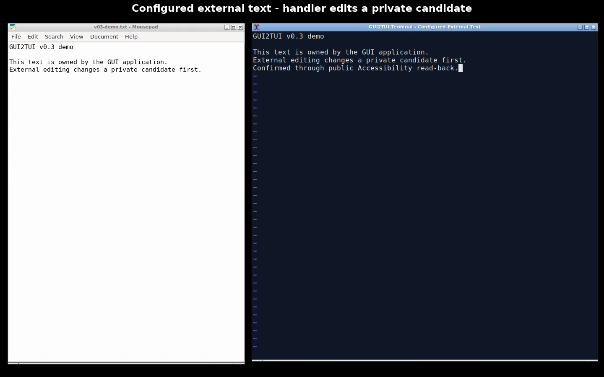
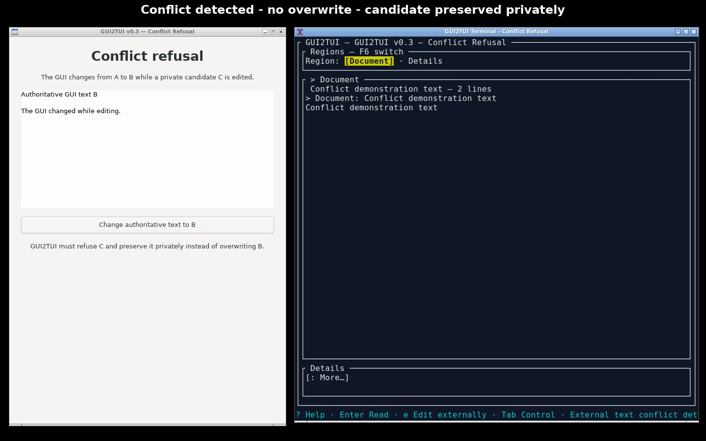
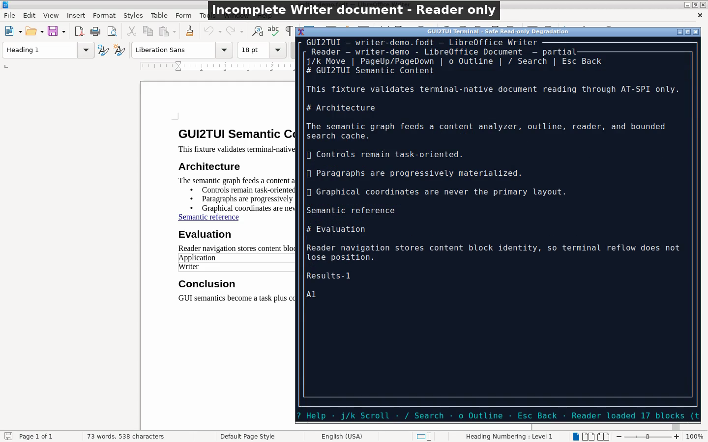

# GUI2TUI v0.3 capability-recovery demonstration

These assets record real GUI2TUI behavior from production source
`571bc906705ce4792921cdc1e75cc67c780abd60`. They demonstrate the v0.3 rule:
an exposed interface or successful request is not enough; GUI2TUI presents a
write as successful only after fresh authoritative GUI read-back.

- [Hero demo](hero-v0.3.mp4) (32 seconds): native Value `4 → 5 → 4`, then
  configured external text interaction.
- [Full demo](demo-v0.3.mp4) (62 seconds): the hero sequence, conflict refusal,
  and a partial Writer document remaining Reader-only.

Representative real frames:









## What the recordings prove

The Value fixture begins at `4`. The terminal-native Up action changes the
public AT-SPI Value to `5`; both the GUI and GUI2TUI show the authoritative
result. Down restores `4`. The fixture's progress value remains informational
and read-only.

Mousepad begins with synthetic multiline text. GUI2TUI qualifies the complete
plain-text target, writes that text to a private owned artifact, and launches a
locally configured handler. The handler changes only that candidate. GUI2TUI
then re-reads the GUI for conflicts, writes through public EditableText, and
re-reads the complete GUI text before reporting confirmation. The external
handler never receives or edits Mousepad's backing file. Its SHA-256 is
`657c4b9ce219cd2259fcf312527ee23b45c20c97f9cbeef33cd85076e226138b`
both before and after the confirmed GUI-buffer change, prior to any GUI save.

The conflict fixture starts from A, changes the authoritative GUI to B while
the handler holds candidate C, and proves that GUI2TUI refuses to overwrite B.
Candidate C remains in private recovery storage. The Writer scene demonstrates
that useful Reader access does not turn `PartialRealized` rich content into a
whole-target edit capability.

Recorded results:

```text
VALUE_DEMO_END_TO_END=PASS
EXTERNAL_TEXT_DEMO_END_TO_END=PASS
EXTERNAL_TEXT_BACKING_FILE_BYPASS=ABSENT
EXTERNAL_TEXT_CONFLICT_REFUSAL=PASS
READ_ONLY_DEGRADATION_DEMO=PASS
REAL_EDITOR_HANDLER_SMOKE=PASS
```

## Generic handler configuration

The public recording used the normal shell-free `program + args + {file}`
configuration. Vim happened to be installed on the recording host; GUI2TUI has
no Vim-specific production path, editor registry, or default editor.

```toml
version = 1

[interaction.complex_text]
program = "/usr/bin/vim"
args = [
  "-n", "-u", "NONE", "-i", "NONE", "--cmd",
  "set backupcopy=yes noswapfile nobackup nowritebackup shortmess+=F laststatus=0 noruler noshowcmd",
  "{file}",
]
```

This example preserves the owned artifact inode and passed the same generic
ownership checks used for every configured handler. If Vim is absent, the
recording script uses the existing deterministic validation handler instead;
that fallback remains a real configured external-handler workflow.

## Reproduce

The recorded environment was Ubuntu 24.04 arm64, AT-SPI 2.52 over a private
D-Bus session, isolated Xvfb X11 at 1440×900, Openbox, and xterm at 92×39.
Applications were the two demo-only fixtures, Mousepad, and LibreOffice Writer.
Capture used ffmpeg x11grab at 20 fps.

Build the existing production binaries, then run the recorder on a Linux host
with the dependencies checked at the top of the script:

```bash
cargo build --release --locked
OUTPUT_DIR=/tmp/gui2tui-v03-demo scripts/demo/record-v03.sh
```

The script creates private XDG config/cache/data/runtime directories, starts a
private D-Bus/AT-SPI/Xvfb session, records four bounded real workflows, derives
the hero/full videos and PNG frames, and deletes the session directory. The
checked-in [`recording.json`](recording.json) records dimensions, durations,
sizes, hashes, handler evidence, source boundary, and privacy assertions.

Recording automation sends keys only to the GUI2TUI terminal (including the
configured terminal editor); it never injects input into a GUI application.
The controlled conflict changes B through the fixture's explicitly named
public AT-SPI `Click` action. All content is synthetic. No credentials,
developer checkout paths, private documents, backing-file mutation, network
operation, or app/toolkit-specific production branch is involved.
