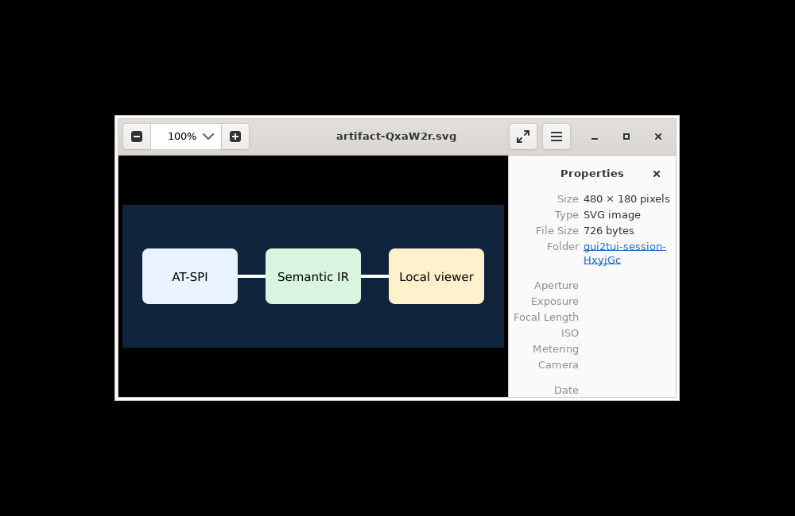
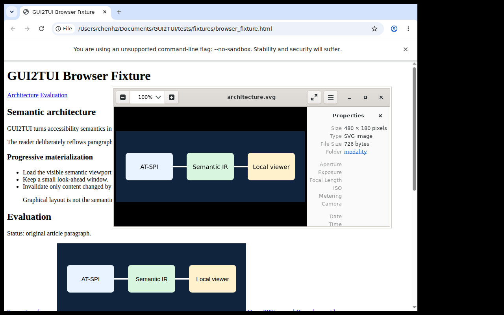
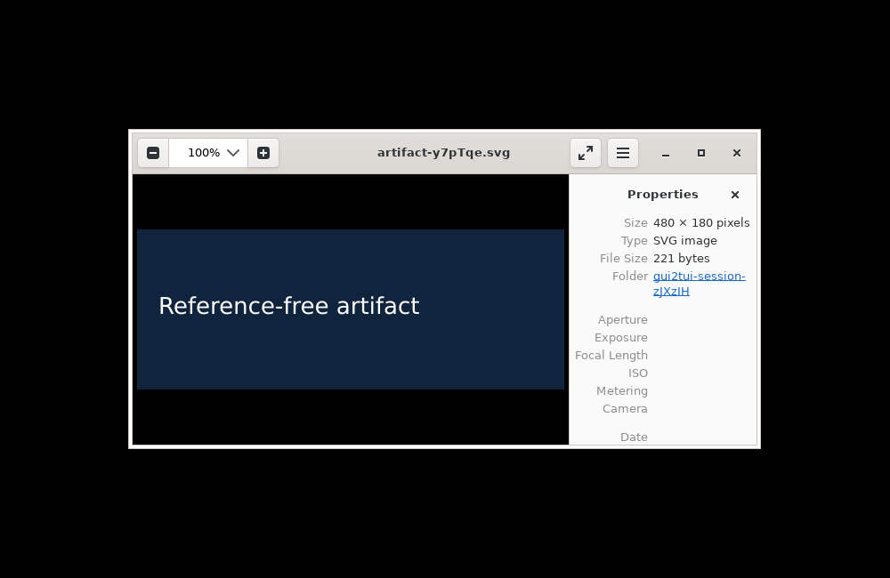

# Representative GUI → semantic TUI examples

These are text exports of frames actually rendered in the Ubuntu 24.04 arm64/Xvfb validation
session on 2026-08-30. They are not hand-designed mockups. Long borders and blank rows are trimmed
for readability.

GUI2TUI does not reproduce GUI pixels. It chooses terminal-native presentation from roles,
relations, states, safe operations, and content structure.

## 1. Browser page → document summary, Reader, outline, and search

The Chrome fixture is a normal HTML page with headings, links, paragraphs, a list, quote, image
alternative text, form controls, and dynamic content. Its default scene begins with a bounded
summary while form controls remain separately reachable:

```text
┌ GUI2TUI — GUI2TUI Browser Fixture - Google Chrome ───────────────┐
│> Document: GUI2TUI Browser Fixture                               │
│    114 blocks | 4 headings | 3 links | 18 forms                  │
│    completeness: Complete                                        │
│    [ Enter: Read document ]                                      │
│    o Outline | / Content search                                  │
│  [ Replace article paragraph ]  (read-only)                      │
│  [ Virtual semantic results: Active Alpha ▼ ]                    │
│  Username: [empty]  (read-only)                                  │
└──────────────────────────────────────────────────────────────────┘
```

Enter opens a Reader owned by the TUI, not a browser popup:

```text
┌ Reader — GUI2TUI Browser Fixture ────────────────────────────────┐
│ j/k Move | PageUp/PageDown | o Outline | / Search | Esc Back     │
│ # GUI2TUI Browser Fixture                                        │
│ Fixture navigation                                               │
│ [Link] Architecture                                              │
│ [Link] Evaluation                                                │
│ Semantic content article                                         │
│ # Semantic architecture                                          │
│ GUI2TUI turns accessibility semantics into terminal-native tasks │
│ and readable content.                                            │
│ # Progressive materialization                                    │
└──────────────────────────────────────────────────────────────────┘
```

The same semantic model produces the outline:

```text
┌ Outline — GUI2TUI Browser Fixture ───────────────────────────────┐
│ ↑/↓ Navigate | Enter Read | / Search | Esc Reader                │
│> GUI2TUI Browser Fixture                                         │
│  Semantic architecture                                           │
│  Progressive materialization                                     │
│  Evaluation                                                      │
└──────────────────────────────────────────────────────────────────┘
```

And indexed/loaded search:

```text
┌ Content search — GUI2TUI Browser Fixture ────────────────────────┐
│> semantic                                                        │
│> Semantic architecture                                           │
│  GUI2TUI turns accessibility semantics into terminal-native tasks│
│  Load the visible semantic viewport.                             │
│  Graphical layout is not the semantic contract.                  │
│  Architecture diagram with semantic graph and terminal reader    │
└──────────────────────────────────────────────────────────────────┘
```

Phase 3F's explicit full search uses the same terminal overlay but shows honest progress and streams
matches. This cleaned frame was captured from the live GTK fixture:

```text
┌ Full document search — GTK rich text article ───────────────────┐
│> semantic                                                       │
│ Full search: Complete — 1 / 1 blocks scanned — 1 match          │
│> GTK semantic content first paragraph...                        │
└─────────────────────────────────────────────────────────────────┘
```

The 7,266-node Chrome cancellation run showed `312 / 7009 blocks scanned`, `42 text RPCs`; Escape
stopped the operation and returned to the Reader. Chrome's real HTML table and ARIA grid produced
terminal table tasks backed by AT-SPI dimensions `3 × 3` and `3 × 2` respectively:

```text
┌ Table — GUI2TUI Browser Fixture ────────────────────────────────┐
│  r1 c1  Name                                                   │
│> r1 c2  Score                                                  │
│  r1 c3  Status                                                 │
│  r2 c1  Alice                                                  │
│  r2 c2  92                                                     │
│  r2 c3  Pass                                                   │
└─────────────────────────────────────────────────────────────────┘
```

Firefox rendered the same page through the same model and Reader. The Phase 3F full-search frame
reached 75 blocks through event-driven page realization and required no new Text RPC because the
visible ranges were already resident. Chrome used 3 RPCs/3 ranges and 171 bytes in its recorded
initial Reader viewport.

## 2. LibreOffice Writer → reflowed document Reader

The source is a real Flat ODT opened in LibreOffice Writer. GUI2TUI does not parse ODT and does not
use UNO; it reads only AT-SPI descendants.

```text
┌ Reader — libreoffice_content_fixture - LibreOffice Document — partial ┐
│ # GUI2TUI Semantic Content                                           │
│ This fixture validates terminal-native document reading through      │
│ AT-SPI only.                                                         │
│ # Architecture                                                       │
│ The semantic graph feeds a content analyzer, outline, reader, and     │
│ bounded search cache.                                                │
│ • Controls remain task-oriented.                                     │
│ • Paragraphs are progressively materialized.                         │
│ • Graphical coordinates are never the primary layout.                │
│ Semantic reference                                                   │
│ # Evaluation                                                         │
│ Reader navigation stores content block identity, so terminal reflow  │
│ does not lose position.                                              │
│ Results-1                                                            │
│ A1                                                                   │
└──────────────────────────────────────────────────────────────────────┘
```

The live model contained 17 blocks and 4 headings. It was marked `partial` because LibreOffice's
document view advertised `manages-descendants`; GUI2TUI did not claim that all logical content was
realized.

## 3. GTK TextView → generic rich-text Reader

This control has no Document role. The generic contract recognizes a read-only multiline Text
object and loads it progressively:

```text
┌ Reader — GTK rich text article ──────────────────────────────────┐
│ GTK semantic content first paragraph.                            │
│                                                                 │
│ Second paragraph is loaded through the generic AT-SPI Text       │
│ interface.                                                       │
│                                                                 │
│ Third paragraph proves that a Document role is not required.     │
└──────────────────────────────────────────────────────────────────┘
```

The recorded viewport used one backend text operation, two ranges, 170 bytes, and 6.9 ms.

## 4. Qt form and radio group → task scene and Choice overlay

GTK/Qt forms are reconstructed by relations and structure rather than copied from pixel geometry.
Passwords are redacted before rendering:

```text
┌ GUI2TUI — GUI2TUI Qt Fixture ────────────────────────────────────┐
│ Username: alice                                                  │
│ Password: [password]  (read-only)                                │
│ [x] Enable feature                                               │
│> [ Theme: Light ▼ ]                                              │
│ [ Choice: Beta ▼ ]                                               │
│ Status: activated                                                │
│ [ Activate safely ]                                              │
│ [ Demo items: Beta ▼ ]                                           │
└──────────────────────────────────────────────────────────────────┘
```

Enter on Theme opens a terminal overlay. It does not open the Qt GUI popup:

```text
┌ Choose choice ──────────────────────┐
│> * Light                            │
│    Dark                             │
└─────────────────────────────────────┘
```

Selecting Dark invoked the named child `Toggle`, refreshed two nodes from two dirty events, and
rendered:

```text
> [ Theme: Dark ▼ ]
Selected "Dark" via Toggle (GUI disclosure calls=0)
```

## 5. Original modality → explicitly authorized local handoff

The following is a trimmed export from the real Chrome PTY test on 2026-08-31,
not a design mockup. F4 opens a terminal task without changing the GUI:

```text
┌ External modality — original content ────────────────────────────────┐
│  Document: "GUI2TUI Browser Fixture"                                 │
│> Image: "Architecture diagram with semantic graph and terminal reader"│
│  Unknown: "Open PDF manual"                                          │
│  Unknown: "Open demo video"                                          │
│  Video: "Native video modality probe"                                │
│  Unknown: "Open portable model"                                      │
│[Open locally] — approval required in local broker                     │
│Local handler accepted resource; reference-only; artifact_bytes=0      │
│↑/↓ Choose resource | Enter Open if available | Esc Return (GUI unchanged)│
└──────────────────────────────────────────────────────────────────────┘
```

Labels in the list show discovery roles; Hyperlink resolution supplies MIME/kind
for PDF/video/model only when selected. This capture used an explicitly configured
recording handler: it proves TUI → broker dispatch, **not a viewer screenshot**.
Firefox completed the same four-reference test. GTK's image instead displayed
`Original modality UNRESOLVED (read-only)`. With no connected broker, a resolved
image displays `Local modality client unavailable (read-only)`, never a fake Open.

The separate **real local viewer** test sent a reference-free SVG descriptor and
726 artifact bytes through the broker to EOG 45.3. The received image was visually
checked, not inferred from the launcher return value:



This is a test screenshot of a local viewer in Xvfb. It is not a production
StaticVisual acquisition path, and no framebuffer is sent by GUI2TUI.

The reference-first version also completed the actual GUI → TUI → EOG chain with
`artifact_bytes=0`. The source browser is visible behind the independent local viewer:



A separate in-memory SVG had **no source URI or source file**. Its fallback
transferred exactly 221 bytes after approval and was also visually verified:



## What these examples demonstrate

```text
GUI pixels/layout                         GUI2TUI output
──────────────────────────────────────    ──────────────────────────
browser scroll page                    →  Reader + Outline + Search
Writer document canvas                →  reflowed semantic blocks
read-only multiline toolkit control   →  generic Reader
radio/list/combo presentation         →  terminal Choice overlay
buttons/inputs inside documents       →  separate reachable tasks
```

Unsupported graphical content remains an explicit opaque/media placeholder. No example uses
framebuffer capture, GUI coordinate scaling, raster conversion, toolkit-private APIs, DOM/CDP, or
document-file parsers.
