===== GUI2TUI v0.2 PHASE 0.2B HANDOFF =====

## 1. Status

Phase: 0.2B — Responsive Region Composition & Semantic Surface Preservation  
Starting revision: `8f5bda736892372e395bac95a817644ea567c099`  
Validated code HEAD: `8f28082bd1863e18ea51f14b6449e2cd0ca295d9`  
SpatialTopology: implemented with normalized inference-only geometry and generic relations  
PresentationObligation: implemented and orthogonal to size  
LayoutDemand: implemented and refined from realized payload  
VisibilityGuarantee: implemented; Pinned/PreferDirect/Collapsible/DiscoverableOnly  
PresentationCoverageAudit: semantic and direct coverage split; five real workflows report missing=0 and improperly-collapsed=0  
Responsive composition: Wide/Medium/Narrow/Compact realization implemented  
Region focus: F6/Shift-F6 regions; Tab/Shift-Tab local controls; modal scope filtered  
Mousepad: PASS — document plus real MenuBar command surface preserved; unavailable toolbar reconstruction documented  
Chromium: PASS — Web Document, pinned application input and current context remain direct through 60 columns  
EOG: PASS — graphical task remains prominent without an oversized empty placeholder  
GTK Demo: PASS — content, controls and exposed input remain separated  
Qt Designer: PASS — payload-aware no-primary workspace replaces equal-pane allocation  
Semantic regressions: PASS  
Performance: bounded 128-request 5K probe PASS; fresh/incomplete same-condition 5x5 comparison PASS  
Overall: **PHASE 0.2B RESPONSIVE REGION COMPOSITION & SEMANTIC SURFACE PRESERVATION VALIDATED**

The pinned/direct visibility contract, real dynamic tab/control update checks, five reference workflows, semantic regressions, same-condition performance comparison and final macOS/Linux quality gates all pass. Complete-Cache reproduction is an environmental limitation, not a blocker, and no readiness wait was added.

---

## 2. Git history

- Branch: `v0.2/spatial-layout`.
- The phase starts from `8f5bda7 fix: locate managed setup helper in source release builds`.
- The public v0.1.0 tag `b4f4c530326cf5623bc75c9a16d54dfd55e6e81a` is untouched.
- `ba07e66 feat: add generic spatial presentation architecture`
- `40d2d4d feat: render and navigate responsive spatial scenes`
- `8f28082 test: validate responsive spatial workflows`
- No reset, rebase, tag move or worktree discard occurred.

---

## 3. Architecture before / after

```text
0.2A:
SemanticRegion + SpatialEvidence
    -> SpatialRegion
    -> RegionPresentation
    -> TuiLayoutPlan
    -> basic spatial renderer

0.2B:
SemanticRegion + SpatialEvidence
    -> SpatialTopology
    -> RegionPresentation
    -> PresentationObligation + LayoutDemand + VisibilityGuarantee
    -> Surface Selection
    -> Coalescing / Compression
    -> Responsive Composition
    -> TUI
```

All new stages are presentation-side. The semantic graph, capability model, operations, content identities, scopes, runtime generation and modality contracts remain authoritative and unchanged.

---

## 4. Genericity contract

Production composition uses semantic region/kind, source ancestry, role, capability, state, scope-filtered scene membership, trusted geometry, normalized topology, payload richness, obligation, demand, visibility guarantee and terminal dimensions.

The production audit found no application/process/executable/window-title/toolkit identity branch and no product-specific layout type. Reference application identities occur only in validation scripts, artifacts, existing launcher examples/tests and documentation. No application name is an input to `SpatialTopology`, surface inference or responsive realization.

---

## 5. SpatialTopology

`SpatialTopology` contains normalized region bounds, comparable-anchor count and deterministic `SpatialRelation`s. Implemented relation kinds are `Contains`, `Inside`, `Above`, `Below`, `LeftOf`, `RightOf`, `Overlaps`, horizontal/vertical adjacency, four edge alignments, horizontal/vertical bands, `PeripheralTo` and `DominatesArea`.

Normalization uses fixed-point 0..1000 values inside a known comparable coordinate-space container. It is inference-only. Terminal layout receives relations and surface policy, never scaled GUI rectangles. Unknown or different coordinate spaces are not compared.

Unit tests prove that changing geometry changes topology without changing surface semantics, while changing semantics over identical geometry changes surface interpretation.

---

## 6. Geometry coverage

The default `SpatialProbeBudget` remains 128. Candidate ranking now favors high-value anchors: window/scope roots, semantic region roots, documents, graphics, toolbar/menu/tab/status/form/navigation containers, focused/current controls, deep single-line inputs and children of major containers. Cached geometry is reused and public AT-SPI `GetExtents(Screen)` probes remain bounded and concurrent.

The 5K probe selected and requested 128 of 5,158 nodes. Geometry metrics: 128 success, 0 failure, 0 rejected, 3.404 ms. Terminal resize uses the retained topology and issues no new geometry request.

---

## 7. PresentationObligation

Actual values: `Persistent`, `Contextual`, `Discoverable`, `Structural`, `DiagnosticOnly`.

- Persistent: primary task, top-level application input, current tab/context, coherent compact controls and focused/current semantic surfaces.
- Contextual: supporting navigation/forms/status/workspace surfaces.
- Discoverable: command hierarchy represented through the command surface/palette.
- Structural and DiagnosticOnly: topology or Inspector evidence without a normal-scene pane.

Obligation determines preservation, not size. A persistent surface may be compact or collapsed-but-reachable.

---

## 8. LayoutDemand

Actual values: `Expand`, `Supporting`, `Compact`, `Minimal`, `Hidden`.

Rich inline content requests Expand. Navigation, forms, tables and workspace panes request Supporting when useful. Inputs, controls, commands and status request Compact. Empty realized panes become Minimal. Structural/diagnostic surfaces are Hidden. Graphical placeholders request Supporting because a small honest fidelity placeholder does not justify a huge terminal pane.

`refine_layout_demands_from_scene` uses the compiled semantic scene to distinguish rich and currently empty payload while preserving region identity and source bindings.

`VisibilityGuarantee::{Pinned, PreferDirect, Collapsible, DiscoverableOnly}` is a third independent axis. Pinned compact surfaces reserve their generic minimum viable row before ordinary surface selection; PreferDirect surfaces are retained next when bounded space remains. DiscoverableOnly and Collapsible surfaces yield first. A surface hidden behind F6 can satisfy semantic coverage but cannot satisfy Pinned direct coverage.

---

## 9. Persistent Input Surface

A single-line plain editable control may become `InputSurface` when it belongs to the active application scope, remains outside the dominant content subtree, and has a trustworthy spatial/current anchor. Deep controls are explicitly prioritized within the bounded geometry schedule. Once accepted, it receives Persistent + Compact + Pinned; document-local inputs are not promoted.

Purpose is inferred from generic accessible role/name/description tokens: Search/Find/Query, Filter, Address/URL/Navigate, otherwise Input. Uncertain purpose stays `Input`; it is never mislabeled Search. Tests cover top-level input, document-local input, known Search purpose and uncertain Input purpose.

---

## 10. Toolbar/control surfaces

Compact control surfaces require combined evidence: meaningful actionable descendants, semantic command/control grouping, coherent band or peripheral relationship, same active scope and useful payload. A top edge alone does not create toolbar semantics.

Meaningful compact peripheral control surfaces receive PreferDirect. Width budgeting shows a bounded subset plus `[: More]`; remaining operations stay reachable without merging backend identity.

Real Mousepad evidence resolves the toolbar question honestly. The showing 640x25 `MenuBar` is `RuntimeNodeId(5)` and coalesces with command source `RuntimeNodeId(279)` into region 3 (`CommandBar`, Persistent/Compact/PreferDirect). Its named menu/menu-item actions include safe `Click` operations. A separate AT-SPI `Unknown(tool bar)` exists but is not showing/visible, has invalid sentinel geometry and exposes no safe child controls; therefore no toolbar buttons are invented. The directly visible `Commands` surface and palette are the safe generic fallback. Repeated-looking controls retain distinct source identities.

---

## 11. Tabs/current-context preservation

Selected named tabs raise their containing surface to Persistent/Compact/Pinned with Navigate purpose, and the title becomes `Current · <accessible name>`. At constrained widths the active context remains direct while additional tabs can be summarized. An unnamed non-interactive tab wrapper is diagnostic when its primary descendant already represents the same context.

The real dynamic check created `Untitled 1` through Mousepad's named `Click` action, observed it selected and directly presented, then selected `review.txt` through the TabList Selection interface. `review.txt` became current, `Untitled 1` lost selected state, both before/after audits had missing=0 and improperly-collapsed=0, and F6 remained operational. The existing correctness-preserving cache/application-dirty refresh path handled the event; no restart or application-specific event logic was used.

---

## 12. PresentationCoverageAudit

The audit now separates semantic coverage from direct coverage and runs independently for 140x40, 100x36, 80x30 and 60x24. Real Chromium output at 60x24:

```text
Terminal 60x24 class=Narrow direct=4 collapsed=4
Semantic surface coverage:
Persistent surfaces: 5
represented directly or collapsed: 5
collapsed but reachable: 1
primary task represented: true
persistent inputs: 1/1
control surfaces: 2/2
tab/current contexts: 1/1
meaningful statuses: 1/1
structural suppressed: 233
missing: []
Direct surface coverage:
Pinned surfaces: 2
directly represented: 2
forced to collapse: 0
improperly collapsed: []
```

All five reference workflows report four terminal classes, zero missing persistent surfaces and zero improperly collapsed pinned surfaces. Layout action reachability also reports `unplaced=0` for every workflow. Full outputs are under `coverage/`.

---

## 13. Region coalescing

Compatible presentations coalesce using shared semantic parentage, scope, kind, compact footprint and spatial-band evidence. Application/window aggregates preserve high-value input and tab anchors rather than swallowing them. Coalescing retains every source `RegionId` and `RuntimeNodeId`; the deterministic binding test compares the complete plan and deterministic counters.

---

## 14. Responsive composition

`TerminalWidthClass::{Wide, Medium, Narrow, Compact}` derives from available columns and generic minimum viable pane width adjusted by surface count. Height determines bounded direct-pane capacity.

- Wide: up to three demand-weighted columns and six useful panes.
- Medium: task surface plus minimum-viable pinned compact rows, then demand-ranked peers.
- Narrow/Compact: task surface plus fitting Pinned rows and at most one PreferDirect peer, with remaining surfaces in the F6 selector.

Selection ranks active region, visibility guarantee, obligation, demand, payload richness and stable region identity. Generic minimum viable width/height checks prevent Pinned collapse while it fits; genuinely insufficient space is recorded as forced collapse. Insufficient space triggers collapse/stack/switch, not proportional shrinking of every GUI pane.

---

## 15. Region focus

F6 advances region focus and Shift-F6 reverses it. Tab/Shift-Tab navigate focusable semantic controls whose source bindings belong to the active region. Up/Down/Page keys affect the active region's viewport. The renderer emphasizes the active title with a `>` marker.

Region order is built from the already scope-filtered scene, so a modal dialog excludes blocked background regions. Focus can raise a region's selection rank, but responsive demand weights bound the adaptation.

---

## 16. Mousepad

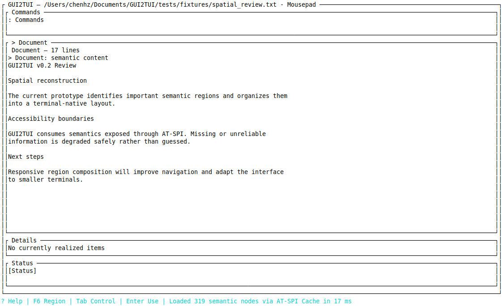

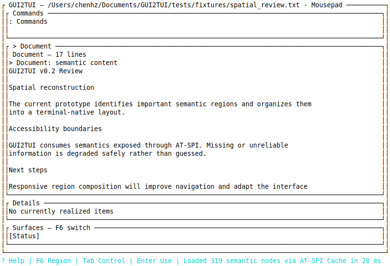

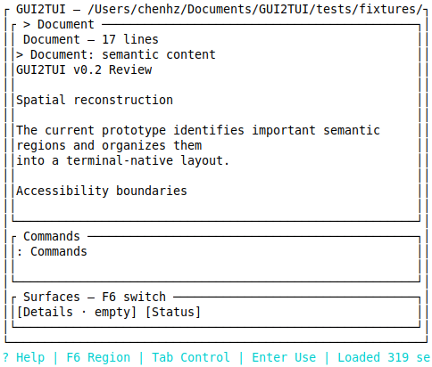

The 319-node workflow uses `ContentDominant`, one primary and four final leaves. The real Document remains an Expand bounded viewport; its 17-line synthetic review is visible inline. The real showing MenuBar becomes a compact direct `Commands` surface; the non-showing, geometry-invalid toolbar does not justify invented buttons. Status/details collapse safely at pressure. Reader remains distinct. Final workflow: first frame 121.10 ms, geometry 49 requests, reachability unplaced=0, coverage missing=0, dynamic current-context PASS.

---

## 17. Chromium

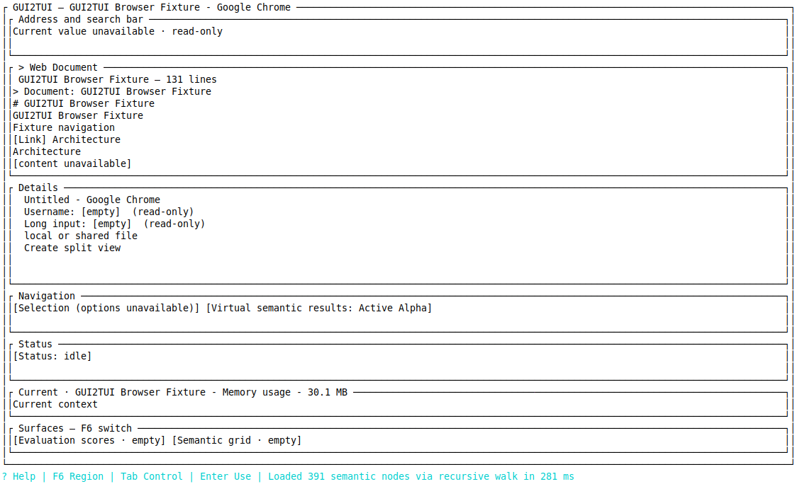

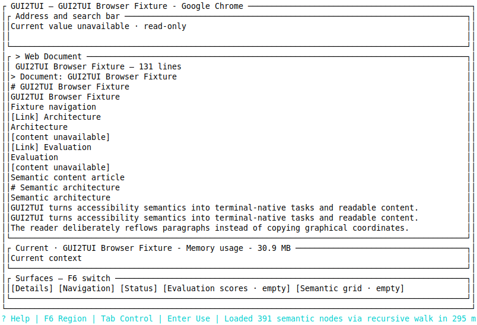

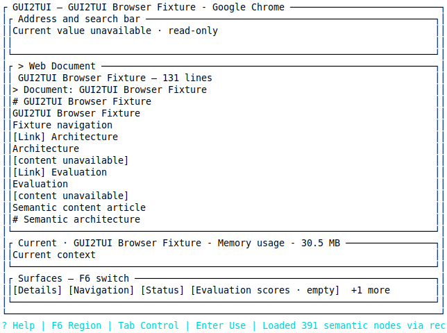

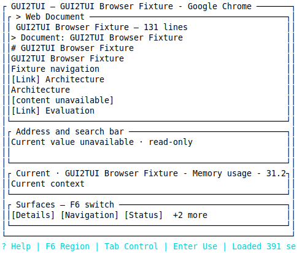

The 391-node workflow remains `ContentDominant`. Web Document is the main bounded content surface. A deeply nested, top-level single-line control is represented from its accessible label as `Address and search bar`; the production rule only knows it as a pinned application input outside the Document subtree. It remains directly visible at 140, 100, 80 and 60 columns. Current context is also direct at 60 columns. Document-local Username/Long inputs stay in the document Details surface and are not promoted.

Final workflow diagnostics: 128 geometry requests, 82 success, 46 rejected; surface 0.294 ms, topology 1.126 ms, composition below 0.001 ms, layout 0.006 ms. Reachability unplaced=0; all four width audits have missing=0 and improperly-collapsed=0.

---

## 18. EOG

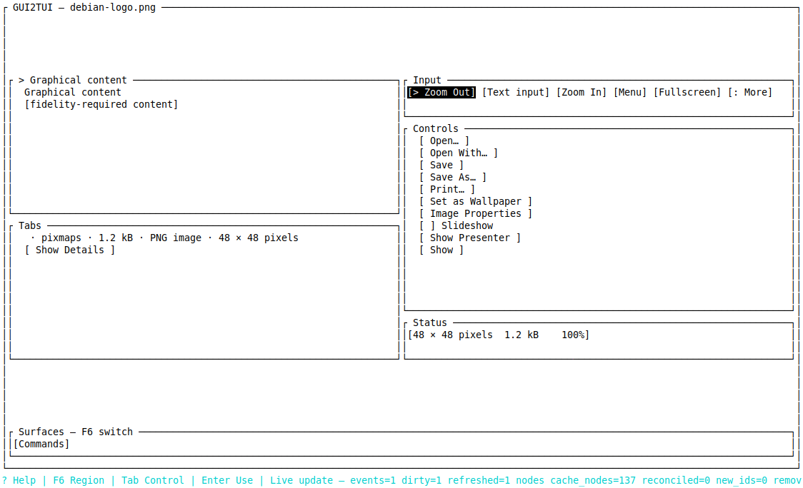

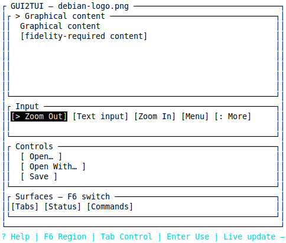

The graphical task remains the default active surface with honest `[fidelity-required content]` presentation. It requests Supporting rather than Expand, so its small payload does not consume an arbitrary 80% of terminal height. At 60 columns, one PreferDirect compact input/control row remains visible (`Zoom Out`, text input, `Zoom In`, `Menu`, `More`) without materially harming the graphical task. Remaining controls/status/commands stay reachable. The workflow has no false forced primary, uses `NavigationDetail`, and reports 28 actionable regions with none unplaced.

---

## 19. GTK Demo

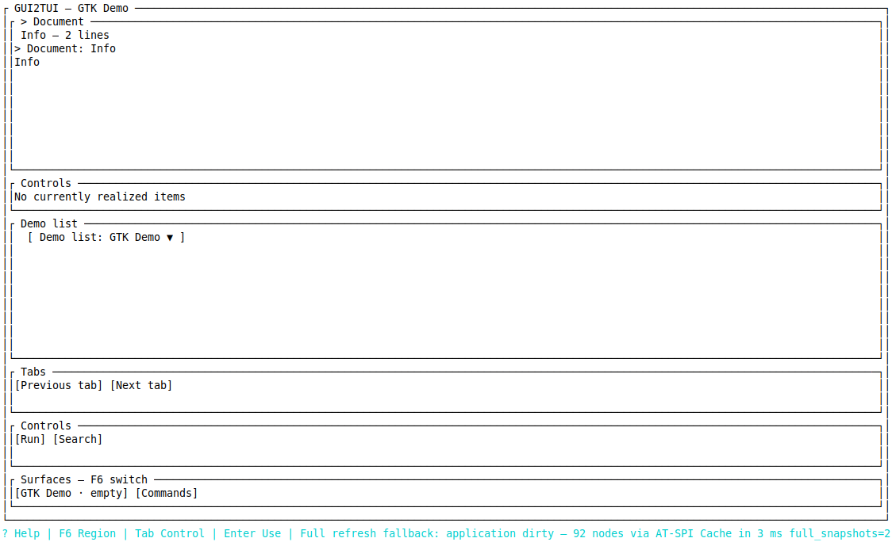

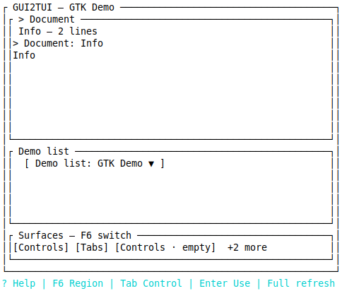

Generic multiline semantic content remains the main detail surface while the demo list, search/input, current tab and Run controls remain separate compact surfaces. The real Search toggle check observed the control surface pressed/shown and then hidden again; the TUI refreshed without restart, retained no stale pinned surface, and coverage stayed missing=0/improperly-collapsed=0. The result follows semantic payload, state, ancestry and topology; no toolkit identity participates.

---

## 20. Qt Designer

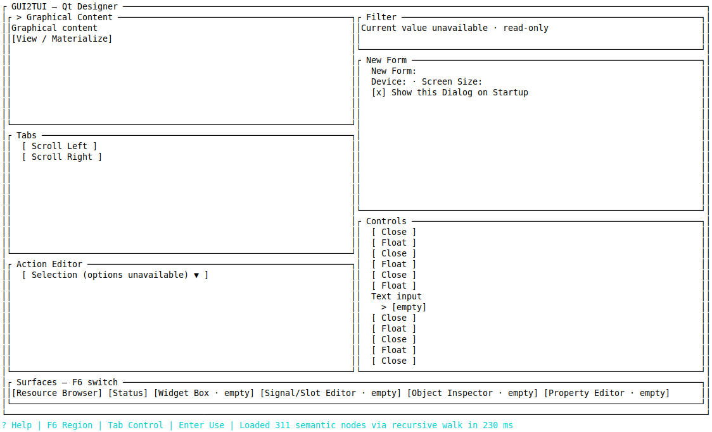

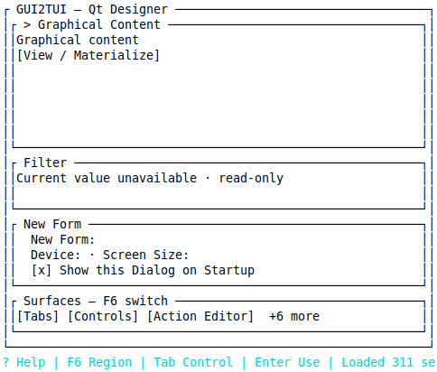

The real 311-node workflow has no valid dominant primary and composes a `DialogForm`/multi-region workspace. Rich panes receive Supporting demand; empty panes become Minimal; status/commands are Compact; structural dock machinery is hidden from the ordinary scene. Narrow mode keeps the graphical task, one genuinely application-level pinned Filter input and the useful form surface, then collapses the remaining panes behind F6. It does not pin every workspace pane or recreate an equal grid. Choice, checkbox and command/dialog workflows pass; 116 actionable regions remain reachable and coverage missing=0.

---

## 21. Degradation presentation

Adjacent inaccessible content gaps are compacted into one bounded notice such as `[… N inaccessible semantic blocks …]`; a single gap renders `[content unavailable]`. Partial realized coverage remains explicitly partial. The renderer never implies complete source coverage and never reads application files or private representations.

---

## 22. Wide/medium/narrow validation

| Terminal | Class in corpus | Evidence |
|---|---|---|
| 140x40/42 | Wide | Mousepad, Chromium, EOG, GTK Demo, Qt Designer wide scenes |
| 100x36 | Medium | Chromium Document + pinned application input/current context direct |
| 80x28/30/32 | Medium | Chromium input remains direct; Mousepad bounded document + controls |
| 60x24/30 | Narrow | Pinned rows remain direct; EOG keeps one compact control row; Qt Designer stays selective |

No tested size panicked or overlapped. Every class kept semantic coverage, and every Pinned surface that met minimum viable size remained direct. All 60-column audits report no missing or improperly collapsed surface.

---

## 23. Performance

Same-condition large-fixture comparison (`fresh/incomplete Cache`, five independent samples per revision):

```text
                          baseline 8f5bda7    current 0.2B
first-frame median:       3,767.55 ms         3,862.66 ms
semantic bootstrap:      3,656 ms            3,788 ms
nodes / Cache items:     5,158 / 228         5,158 / 228
RSS median:              38,464 KiB          42,248 KiB
FD median:               18                  18
geometry RPCs:           n/a                 128
spatial/presentation:    n/a                 25.354 ms median
```

Per-run first-frame results:

| Run | Baseline | Current |
|---:|---:|---:|
| 1 | 3,656.25 ms | 3,862.66 ms |
| 2 | 3,833.52 ms | 3,836.89 ms |
| 3 | 3,766.44 ms | 3,773.47 ms |
| 4 | 3,767.55 ms | 4,064.85 ms |
| 5 | 3,981.53 ms | 4,052.65 ms |

The current median delta is +95.11 ms (+2.52%) for first frame and +132 ms (+3.61%) for semantic bootstrap; RSS is +3,784 KiB (+9.84%), with FD unchanged. Every run rejects the same incomplete 228-item bulk Cache and safely uses the recursive walk. The 128 geometry RPCs remain far below 5,158 nodes, and the median spatial/presentation work is about 25.35 ms. This is well below the 20–25% investigation threshold. Cache-ready inability is therefore classified as environment state, not a 0.2B blocker; no fixed sleep or forced readiness behavior was introduced. Full samples are in `benchmark-fresh-incomplete.json`.

---

## 24. Semantic regression

PASS: Button, safe single-line EditableText, password exclusion/redaction, Choice, Selection, Commands, Reader, Outline, Search/cancellation, Table, anonymous Action refusal, stale-generation identity, modal scope, multiline document safety and modality honesty. Spatial presentation creates no backend action and cannot bypass scope or operation resolution.

---

## 25. Tests

There are 37 focused spatial tests. They cover topology/normalization, coordinate mismatch, generation invalidation, persistent and local inputs, known/uncertain purpose, toolbar/status/tab surfaces, multi-tab narrow behavior, primary/no-primary layouts, payload-aware demand, graphics, structural suppression, coalesced source bindings, deterministic plans, responsive preservation, modal region filtering, semantics/geometry orthogonality and resize identity.

Final full-suite counts after these additions are recorded in section 26.

---

## 26. Quality

- macOS arm64: fmt/check/test/clippy/diff PASS; 274 library + 2 inspector + 4 CLI = 280 tests.
- Linux Ubuntu 24.04 arm64 under OrbStack: fmt/check/test/clippy/diff PASS; 275 library + 2 inspector + 4 CLI = 281 tests.
- Clippy ran with all targets/features and `-D warnings`.
- `git diff --check` passes.
- `.DS_Store` is ignored and no accidental OS artifact is included.

---

## 27. Production branch audit

Confirmed for the presentation production path:

- no application/process/executable/window-title identity rule;
- no toolkit-name branch or application-specific layout;
- no DOM/CDP or UNO;
- no private toolkit/application API;
- no OCR, vision or screenshot segmentation;
- no keyboard/mouse semantic fallback;
- no anonymous `action[0]` guessing;
- no GUI-coordinate-to-terminal-coordinate scaling.

Repository-wide identity hits are existing launcher examples/tests, diagnostics comments or validation material, not production presentation decisions.

---

## 28. Remaining issues

- P0: none.
- P1: none remaining for the 0.2B acceptance contract. Real current-context and control visibility updates pass; the existing correctness-preserving full-refresh fallback is acceptable when an application dirties its whole accessibility cache.
- P2: presentation polish, command ranking, finer status wording, mouse UX and further space-efficiency tuning belong to a future phase.

---

## 29. Architecture conclusion

Yes. GUI2TUI now uses generic semantic evidence plus trusted GUI spatial topology to preserve important application surfaces and compress them into responsive terminal-native scenes, with and without a dominant content region. Pinned application inputs/current context remain direct at viable sizes, preferred controls yield only after pinned surfaces, and semantic/direct coverage are audited separately. It does not copy pixel coordinates or specialize for an application, and semantic correctness remains unchanged.

**PHASE 0.2B RESPONSIVE REGION COMPOSITION & SEMANTIC SURFACE PRESERVATION VALIDATED.**

---

## 30. Next Codex context

GUI2TUI v0.2B 已在 `v0.2/spatial-layout` 完成并按逻辑提交。核心提交为 `ba07e66`（空间证据/拓扑/呈现模型）、`40d2d4d`（响应式 renderer 与 region 交互）、`8f28082`（真实 workflow 与动态验证）。新增独立 `VisibilityGuarantee`：应用级单行输入及当前 tab/context 为 Pinned，紧凑控制面为 PreferDirect；响应式选择先满足通用最小直显尺寸，F6 仅承接可折叠部分。`PresentationCoverageAudit` 已拆为语义覆盖与直显覆盖；五个真实 workflow 在 140/100/80/60 列均 missing=0、improperly-collapsed=0、unplaced=0。13 张原图及逐宽度诊断已存入 responsive 目录。Chromium 60 列仍直显 Address/Search 与 current context；EOG 窄屏保留紧凑缩放行；Qt Designer 保持非等分多区。Mousepad 真实证据显示 640x25 MenuBar 可安全汇入 Commands，另一个 tool bar 不 showing、几何无效且无安全子控件，因此未虚构按钮。真实动态验证已通过：Mousepad 新建 tab 后安全切回旧 tab，GTK Demo Search 显示/隐藏无需重启且无陈旧 surface。5K 同条件性能 +2.52%，128/5158 几何 RPC；完整 Cache 不可复现属于环境限制，未加入等待 hack。macOS 280 与 Linux 281 tests、fmt/check/clippy/diff 全部通过。后续不得回退 v0.1 tag 或加入应用/toolkit 特判；下一阶段若启动，应另行定义而非继续扩展 0.2B。

===== END GUI2TUI v0.2 PHASE 0.2B HANDOFF =====
