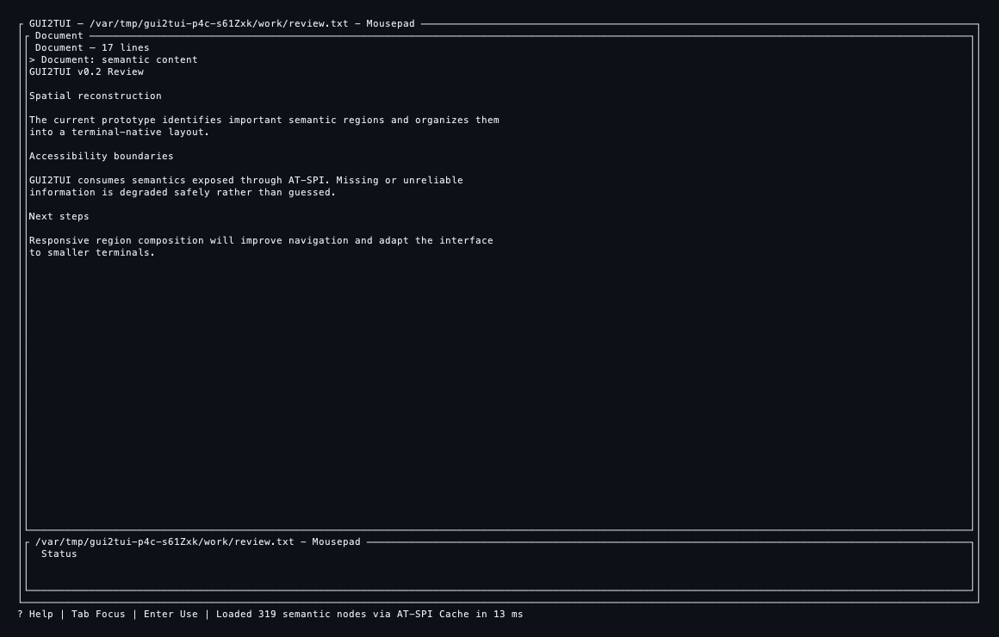
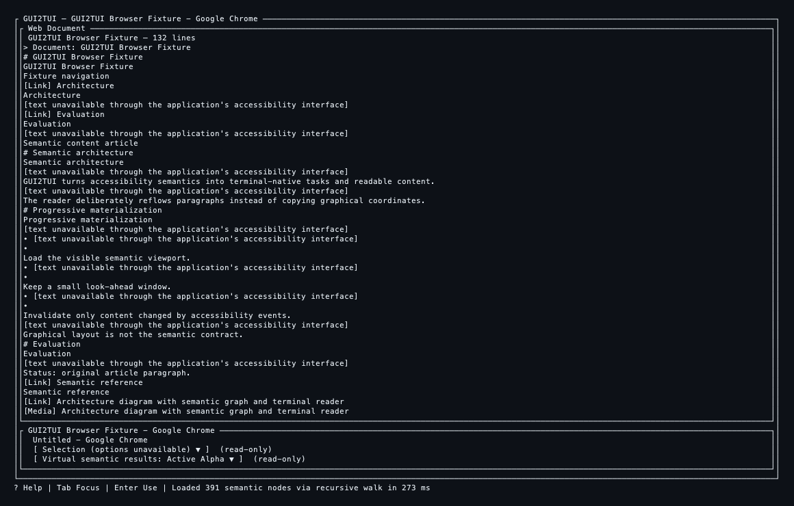
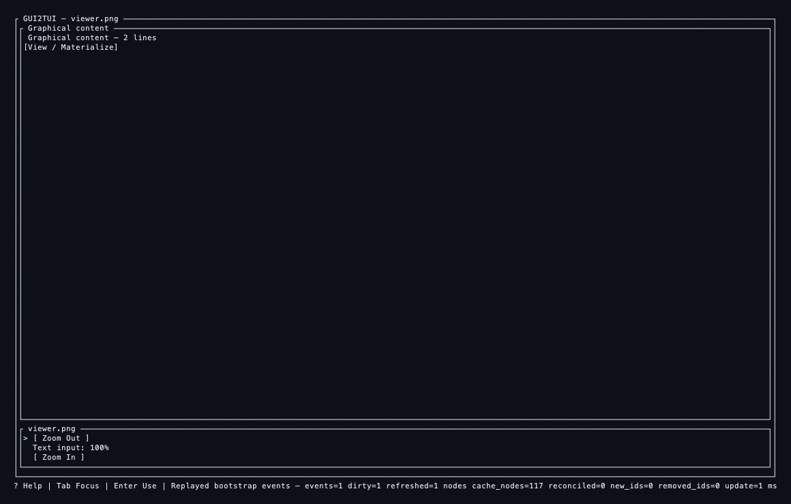
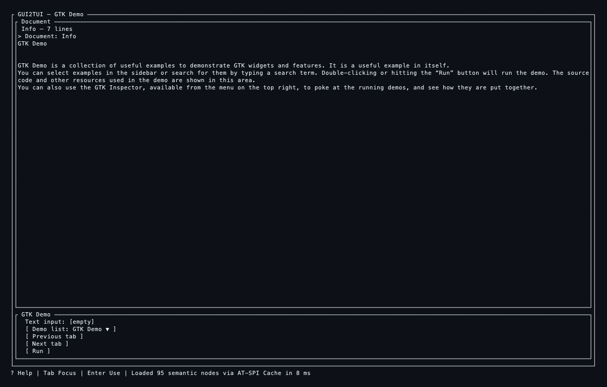
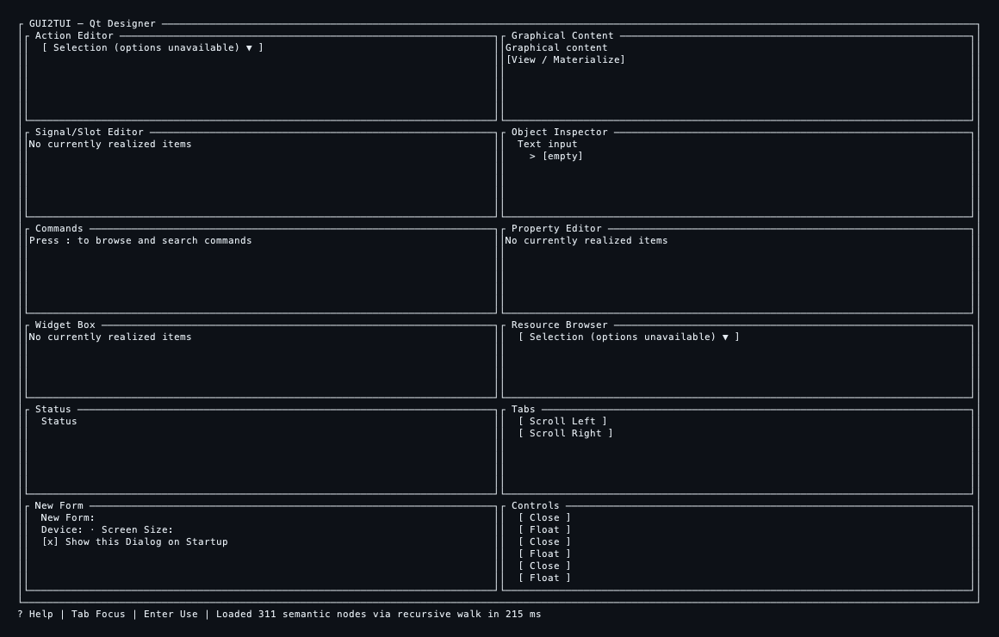

===== GUI2TUI v0.2 PHASE 0.2A HANDOFF =====

## 1. Current status

Phase: 0.2A — Spatial Reconstruction Prototype  
Branch: `v0.2/spatial-layout`  
Starting revision: `8f5bda736892372e395bac95a817644ea567c099`  
Current HEAD: `8f5bda736892372e395bac95a817644ea567c099`  
SpatialEvidence: generation-scoped real AT-SPI geometry, explicit coordinate/trust model, bounded to 128 candidates  
RegionPresentation: implemented; meaningful/structural/diagnostic/empty payloads separated  
Composition planning: implemented; primary is optional and six generic composition forms are available  
Experimental renderer: `--layout spatial`; real plan-driven panes, splits, compact support and bounded inline viewport  
Mousepad: WORKFLOW PASS; normal Document scene PASS  
Chromium: WORKFLOW PASS; normal Web Document scene PASS  
EOG: WORKFLOW PASS; normal graphical-primary scene PASS  
GTK Demo: WORKFLOW PASS; semantic detail + controls scene PASS  
Qt Designer: WORKFLOW PASS; `DialogForm`, primary=0, multi-region scene PASS  
Chrome 5K: fresh/incomplete benchmark PASS; current cache-ready condition not reproduced  
Semantic regressions: PASS  
Core semantic IR: unchanged  
Overall: **PHASE 0.2A NOT YET VALIDATED**

The remaining blocking gate is a current-run Chrome 5K complete-Cache sample. Four independent attempts exposed only 228–236 Cache records and correctly used the recursive walk; no result is relabelled as cache-ready.

---

## 2. Git history

- The branch still points at the required baseline `8f5bda7 fix: locate managed setup helper in source release builds`.
- The public v0.1.0 tag `b4f4c530326cf5623bc75c9a16d54dfd55e6e81a` is untouched.
- Phase 0.2A work remains intentionally uncommitted because the mandatory current cache-ready performance gate is not complete.
- No reset, rebase, tag move or baseline reinterpretation occurred.

---

## 3. Architecture before / after

```text
v0.1:
SemanticRegion
    -> flat/reflow scene

early v0.2A:
SemanticRegion + SpatialEvidence
    -> SpatialRegion
    -> TuiLayoutPlan

final v0.2A prototype:
SemanticRegion + SpatialEvidence
    -> SpatialRegion
    -> RegionPresentation
    -> generic CompositionKind
    -> TuiLayoutPlan
    -> experimental spatial scene
```

---

## 4. Freeze boundary

UNCHANGED: semantic identity, runtime/application generations, semantic capabilities, relation semantics, content semantics/identity, commands, choices, scopes, runtime recovery and modality.

EVOLVED: presentation-side geometry evidence, presentation classification, composition, terminal-independent layout planning, bounded inline presentation and experimental rendering only.

---

## 5. SpatialEvidence

`SpatialEvidence` contains `RuntimeNodeId`, `SpatialBounds`, `CoordinateSpace`, visibility/showing, optional layer, `GeometryTrust`, generation and provenance. `SpatialEvidenceIndex` owns generation-scoped entries and `SpatialProbeMetrics`.

`from_backend` uses public AT-SPI `GetExtents(Screen)`, reuses cached geometry, limits candidates to 128 and runs at most eight probes concurrently. Invalid, zero-sized and sentinel/off-screen extents are rejected. Resize re-realizes the existing plan without re-querying geometry.

---

## 6. RegionPresentation

Actual `RegionPresentationKind` values:

`InlineContent`, `Navigation`, `Form`, `ChoiceList`, `Table`, `CommandBar`, `GraphicalPlaceholder`, `Status`, `ControlGroup`, `WorkspacePane`, `CollapsedSummary`, `Structural`, `DiagnosticOnly`, `Empty`.

Each presentation records semantic title, source `RegionId`s, source `RuntimeNodeId`s, meaningful-item count, dominant eligibility and explainable reasons. It carries no backend operation.

---

## 7. PrimaryContent validity

Dominance requires a meaningful presentation payload. Actual content blocks or substantial multiline semantic text produce `InlineContent`; mixed text/media documents remain inline. Pure fidelity-required content may produce `GraphicalPlaceholder`. Tables/forms require meaningful descendants and trustworthy relative evidence.

Content with no useful inline payload becomes `Empty` and records: `Reader-only/empty placeholder is not eligible for dominant allocation`. Text volume is not a dominance score; a unit test proves a 500-block small peer loses to a one-block spatially dominant document.

---

## 8. No-primary composition

`PrimaryContent = None` is valid. The planner materializes multiple meaningful peers through `NavigationDetail`, `MultiPaneWorkspace`, `DialogForm`, `ControlSurface` or `FallbackStack`. Qt Designer is the real corpus case: primary=0 and the false empty dominant pane is gone.

---

## 9. Composition model

Actual `CompositionKind` values:

- `ContentDominant`
- `NavigationDetail`
- `MultiPaneWorkspace`
- `DialogForm`
- `ControlSurface`
- `FallbackStack`

Rules use presentation payload, semantic role/kind, source hierarchy, known-coordinate geometry, containment/adjacency and relative dominance. GUI pixel percentages never become terminal percentages. `LayoutImportance::{Dominant, Supporting, Compact, Structural}` independently drives terminal allocation.

---

## 10. Region coalescing

Compatible siblings can coalesce by semantic parent and presentation kind. Presentable containers absorb compatible descendants; compact application-scope groups can coalesce when their individual footprint is small. Every source region/node binding is retained. Reasons include the source region and semantic parent, and deterministic/coalesced-binding tests pass.

---

## 11. Structural suppression

Separators, resize handles, split/layered panes and empty structural containers remain in semantic/Inspector diagnostics but receive `Structural` or `DiagnosticOnly` presentation and no standalone experimental row. Unsupported tree/list/tab containers can instead become Navigation/Choice/Workspace grouping when descendants are useful. Ordinary rectangle intersection cannot invent an overlay; only semantic dialog/overlay evidence permits it.

---

## 12. Main-scene viewport model

The main scene reuses `ContentRuntime`, `SemanticContentModel` and bounded `materialize_viewport`. Startup prefetch is capped at eight content blocks/eight paragraph ranges; that is a loading bound, not a fixed number of displayed rows. Logical lines are clipped and scrolled by the actual pane height and shared viewport offset. Reader remains the separate progressive full-content task with Outline/Search/Table behavior. A renderer test verifies that a 20-line payload in a small pane shows the scrolled window and not off-viewport lines; extending main-scene materialization during deep scrolling remains a 0.2B refinement.

---

## 13. Mousepad



- Terminal: 160×50; layout: spatial; nodes: 319.
- Composition: `ContentDominant`; primary: Document/`InlineContent`; leaves: 3.
- Geometry: 49 candidates/requests, 14 successes, 34 rejected, 1 failure, 1.291–1.392 ms.
- Workflow first frame: 122.75 ms; layout reachability: 233 actionable, 0 unplaced.
- Realistic 17-line synthetic review is bounded inside the dominant pane; Reader remains distinct.
- Multiline content never receives atomic EditableText capability; Reader, About dialog, restart and stale-generation checks pass.

---

## 14. Chromium



- Terminal: 160×50; layout: spatial; nodes: 391.
- Composition: `ContentDominant`; primary: Web Document/`InlineContent`; leaves: 23 before terminal compaction.
- Geometry: 128 candidates/requests, 80 successes, 48 rejected, 2.391 ms.
- First frame: 316.66 ms using correctness recursive walk; layout reachability: 3 actionable semantic regions, 0 unplaced.
- Mixed document media no longer converts the whole document to a graphical placeholder.
- Web Document is dominant; browser/window controls are in a separate compact supporting pane; structural/contained graphics do not flood the scene.
- Reader, Outline, Search/cancellation, content mutation, Table, modality honesty and stale-generation workflow checks pass.

---

## 15. EOG



- Terminal: 160×50; layout: spatial; nodes: 117.
- Composition: `ContentDominant`; primary: trusted graphical content/`GraphicalPlaceholder`; leaves: 4.
- Geometry: 53 requests, 25 successes, 27 rejected, 1 failure, 1.596 ms.
- First frame: 117.52 ms; layout reachability: 28 actionable, 0 unplaced.
- The large placeholder honestly offers View/Materialize; zoom controls are compact below it.
- A non-interactive graphical peer without trusted geometry is diagnostic beside the trusted primary, eliminating the duplicate placeholder.
- About Image Viewer command/dialog open and close pass.

---

## 16. GTK Demo



- Terminal: 160×50; layout: spatial; nodes: 95 at TUI bootstrap.
- Composition: `ContentDominant`; primary: substantial read-only Info text/`InlineContent`; leaves: 2.
- Geometry: 66 requests, 57 successes, 8 rejected, 1 failure, 2.108 ms.
- First frame: 117.87 ms; layout reachability: 22 actionable, 0 unplaced.
- The scene shows semantic detail plus search/demo-list/tab/run controls. Reader/detail and real search text editing pass.
- This result comes from substantial multiline semantic payload, not a product identity or forced Document role.

---

## 17. Qt Designer



- Terminal: 160×50; layout: spatial; nodes: 311.
- Composition: `DialogForm`; primary: none; leaves: 12.
- Geometry: 87 requests, 69 successes, 18 rejected, 2.034 ms.
- First frame: 347.62 ms; layout reachability: 116 actionable, 0 unplaced.
- The false empty `Semantic content` dominant pane is removed.
- Action Editor, Signal/Slot Editor, Object Inspector, Property Editor, Widget Box, Resource Browser, Commands, Status, Tabs, New Form and Controls are grouped into peer panes.
- Choice navigation, checkbox toggle and command/dialog context pass; no full-screen Unsupported dump remains.

---

## 18. Structural-noise audit

Classification unit is each row of the prior flat scene, cross-referenced with the spatial presentation plan:

| Application | Flat rows | User-relevant | Supporting/grouped | Structural-only | Diagnostic-only | Duplicate command summary | Spatial leaves |
|---|---:|---:|---:|---:|---:|---:|---:|
| Mousepad | 8 | 1 | 3 | 0 | 2 | 2 | 3 |
| Chromium | 59 | 51 | 4 | 1 | 3 | 0 | 23 |
| EOG | 46 | 26 | 3 | 8 | 8 | 1 | 4 |
| GTK Demo | 36 | 27 | 7 | 0 | 1 | 1 | 2 |
| Qt Designer | 94 | 23 | 13 | 5 | 45 | 8 | 12 |

These counts explain presentation policy; they do not delete semantic nodes or claim every supporting item is currently shown as a dedicated pane.

---

## 19. Explainability

Real plan examples:

- accepted: `role = Document; presentation-capable InlineContent selected for dominant allocation; trusted geometry available for dominance comparison`;
- rejected: `primary candidate rejected: Empty presentation is not dominant-capable`;
- coalesced: `coalesced compatible sibling region ... under semantic parent ...`;
- structural: `structural-only object retained for layout diagnostics`;
- graphical suppression: `untrusted non-interactive graphical peer is diagnostic beside a trusted graphical primary`.

Plan dumps in `evidence/*-layout-plan.txt` include source region and runtime-node bindings.

---

## 20. Action reachability

`audit_layout_reachability` ran in all five full workflows and reported `unplaced=0`:

Mousepad 233/0, Chromium 3/0, EOG 28/0, GTK Demo 22/0, Qt Designer 116/0 (actionable/unplaced). Complete command surfaces remain in the existing Command Palette; Reader/Choice/Form/Table surfaces remain unchanged. Spatial grouping creates no backend actions.

---

## 21. Chrome 5K performance

Fresh/incomplete Cache (current spatial binary):

- nodes: 5,158; composition: `ContentDominant`; regions/leaves: 3,627/21;
- semantic bootstrap: 3,525 ms in the captured report (recursive walk);
- candidates/RPCs: 128/128; successes/rejected: 79/49;
- geometry enrichment: 2.587 ms;
- RegionPresentation + composition + layout-plan analysis: 3.063 ms in the diagnostic run;
- independent first frames: 3,721.22 / 3,768.71 / 3,721.11 / 3,646.54 ms; warm median 3,721.11 ms;
- historical v0.1 same-condition median: 4,054.31 ms; no >20–25% regression.

Cache-ready:

- Four current independent attempts exposed only 228–236 Cache records, so correctness rejection was mandatory. In the latest attempt the public Cache remained at 228 records before and after the recursive client stayed alive; the fallback still traversed all 5,158 nodes and rendered its first frame in 3,408.87 ms.
- No current sample is labelled cache-ready. Historical v0.1 complete-Cache median remains 223.23 ms, but it is not substituted for a current v0.2 measurement.
- This missing current condition keeps Phase 0.2A formally **NOT YET VALIDATED**.

---

## 22. Semantic regressions

PASS: Button, safe single-line EditableText, Password exclusion/redaction, Choice, Selection, Command, Reader, Outline, Search, Table, anonymous Action refusal, stale-generation identity, modal confinement and multiline document safety. Spatial code changes no semantic capability or operation resolver.

---

## 23. Tests

Linux complete suite: 250 library + 2 inspector binary + 4 CLI integration = **256 PASS**, 0 failed. macOS complete suite: 249 library + 2 inspector binary + 4 CLI integration = **255 PASS**, 0 failed. New tests cover meaningful/empty primary, no-primary, multi-pane, NavigationDetail, DialogForm, ControlSurface, mixed text/media, text-volume independence, coalesced bindings/determinism, coordinate mismatch, stale generation, structural rows, non-invented overlays, untrusted graphics and bounded/scrolled inline rendering.

---

## 24. Quality

- macOS: `cargo fmt --all -- --check`, `cargo check --all-targets --locked`, 255 tests and clippy `-D warnings` pass. The artifact-lifecycle test passed both its isolated rerun and the subsequent full-suite rerun.
- Linux/OrbStack Ubuntu 24.04 arm64: fmt, check, 256 tests and clippy `-D warnings` pass using an isolated Linux target directory.
- `git diff --check`: pass.

---

## 25. Production branch audit

The Phase 0.2A production diff contains no application/process/executable/window-title/toolkit identity branch and no per-product layout type. It contains no DOM/CDP, UNO, private toolkit API, OCR/vision, screenshot recognition, coordinate scaling, keyboard/mouse semantic fallback or anonymous-action guessing. Existing unrelated launcher examples/tests are not spatial decisions. Reference application names occur only in validation files/docs.

---

## 26. Remaining issues

- P0: none.
- P1: current Chrome 5K complete-Cache condition could not be reproduced; mandatory cache-ready v0.2 timing remains open.
- P2: the prototype renderer intentionally leaves final responsive collapse, region focus and visual density refinement to 0.2B; some peer panes can be sparse, while remaining honest and reachable.

---

## 27. Architecture conclusion

Yes for the real normal-scene corpus: generic semantic regions plus bounded trusted geometry now produce visibly understandable content-dominant, graphical-dominant and no-primary multi-region scenes without changing semantic correctness. Mousepad is document-centered, Chromium is Web Document plus supporting controls, EOG is graphical-centered, GTK Demo is detail plus controls, and Qt Designer is a peer-pane dialog/workspace rather than an empty fake document.

Formal phase validation remains withheld solely because the current Chrome 5K cache-ready performance condition has not been obtained.

---

## 28. Phase 0.2B recommendation

After the remaining 0.2A performance gate closes, proceed only to **Phase 0.2B — Responsive Region Composition**: refine terminal-native sizing/coalescing, region focus, responsive collapse/reflow and narrow-terminal realization. Do not replace generic semantics with product templates and do not map GUI coordinates to terminal coordinates.

---

## 29. Git status

HEAD remains the required baseline. The worktree intentionally contains the Phase 0.2A implementation, live harness, architecture docs, five normal-scene text/PNG artifacts and evidence reports. `.DS_Store` files are excluded from the intended change. No Phase 0.2A commit has been created while the cache-ready gate is open.

---

## 30. Next Codex context

GUI2TUI v0.2A 仍在 `v0.2/spatial-layout`，HEAD 为基线 `8f5bda736892372e395bac95a817644ea567c099`，现有工作树不可重置。presentation-only 路径已完整贯通：真实 AT-SPI 几何 sidecar（默认 128 候选、8 并发、generation scoped）→ SpatialRegion → RegionPresentation → 六类通用 composition → TuiLayoutPlan → `--layout spatial` 实验 renderer。PrimaryContent 必须有真实 payload，也允许不存在；混合网页优先 InlineContent，纯图形使用诚实占位；结构/诊断对象不再成为普通行；普通矩形相交不会制造 overlay。五个 OrbStack 真实应用完整 workflow 均 PASS，正常主场景图片已保存；Mousepad/Chromium/EOG/GTK Demo/Qt Designer 的 layout reachability 均为 unplaced=0，Qt Designer primary=0。Linux 全套 256 tests 通过；macOS 为 249 library + 2 inspector + 4 CLI，共 255 tests 通过；两端 fmt/check/clippy 通过。Chrome 5K fresh/incomplete 四样本中位 3721.11 ms，5158 节点仅 128 geometry RPC；但四次独立会话只得到 228–236 条 Cache，尚无当前 cache-ready 样本，因此 HANDOFF 必须保持 `PHASE 0.2A NOT YET VALIDATED`。下一步只需在相同 OrbStack 环境复现完整 5158-item Cache，记录当前 spatial 首帧/分阶段耗时；通过后复核 diff、按逻辑提交，再进入 0.2B Responsive Region Composition。禁止任何应用/进程/标题/toolkit 特判、DOM/CDP、UNO、OCR/vision、私有 API、坐标缩放或 action 猜测。

===== END GUI2TUI v0.2 PHASE 0.2A HANDOFF =====
