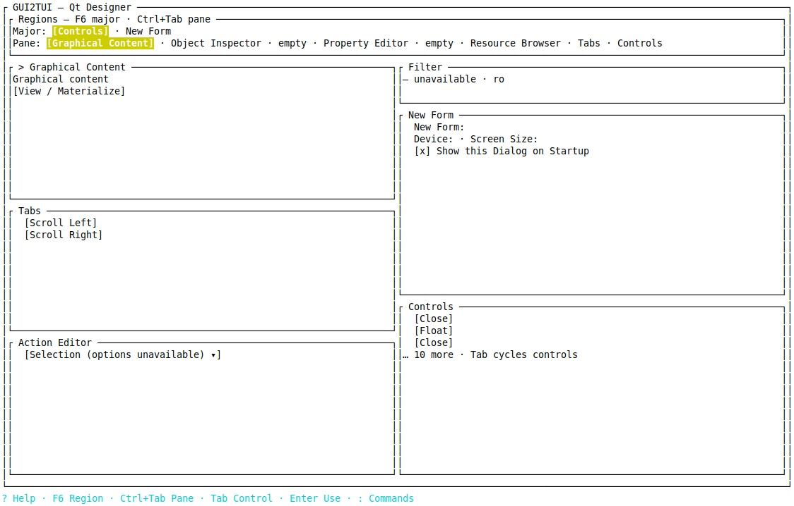
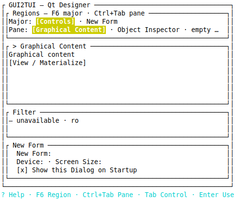
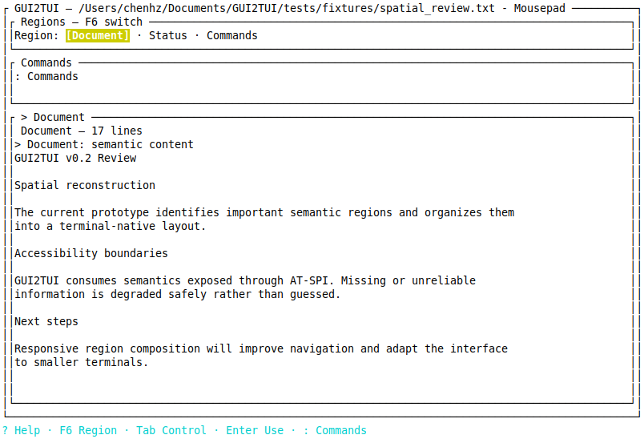
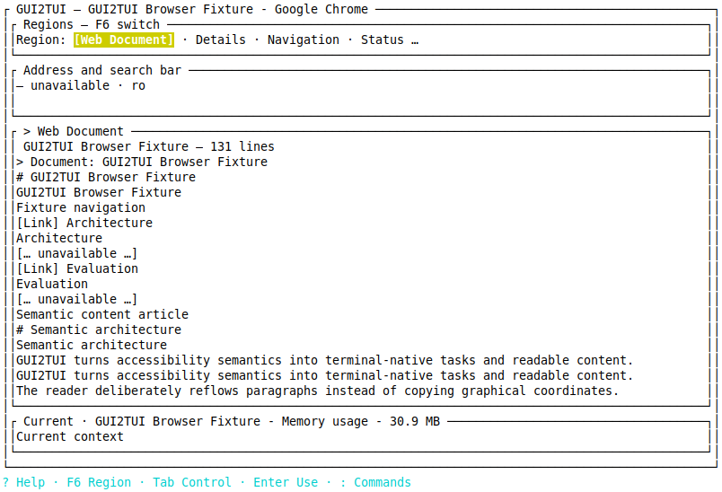
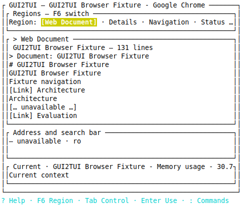
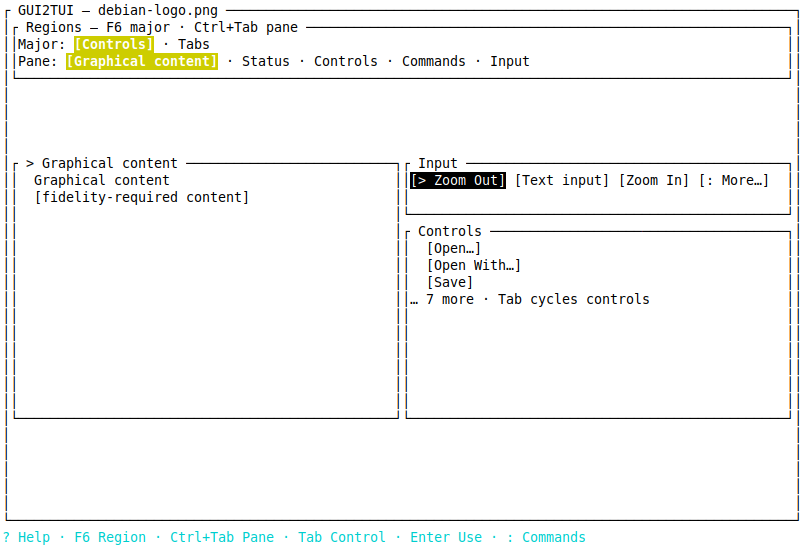
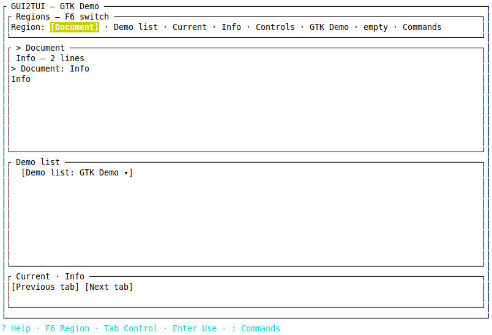

===== GUI2TUI v0.2 PHASE 0.2C HANDOFF =====

## 1. Status

Phase: 0.2C — Terminal UX Refinement  
Starting HEAD: `35c38c92bac902216e4a7d71e0a6ce3f77fb0c76`  
Validated code HEAD: `124924aee7c6a40125c571fa41e3a0ff8aaabdc7`  
Worktree: clean after the validation-documentation commit  
Hierarchical Region Navigation: PASS  
Major region navigation: PASS — F6 / Shift+F6  
Subregion navigation: PASS — Ctrl+Tab / Ctrl+Shift+Tab  
Control navigation: PASS — Tab / Shift+Tab remains local to the active region when controls exist  
Contextual surface simplification: PASS  
Visual semantic polish: PASS  
Contextual footer/help: PASS  
Mouse changes: NONE  
Semantic regressions: PASS  
P0: 0  
P1: 0  
Overall: **PHASE 0.2C TERMINAL UX REFINEMENT VALIDATED**

---

## 2. Git history

- `3a5b0ed feat: add hierarchical region navigation`
- `124924a feat: refine terminal surface presentation`
- Validation documentation is committed separately after the validated code.

The branch was not reset or rebased. The public v0.1.0 tag remains unchanged.

---

## 3. Scope audit

No changes were made to SpatialTopology, normalized geometry, geometry scheduling, PrimaryContent inference, RegionPresentation, PresentationObligation, LayoutDemand, VisibilityGuarantee, PresentationCoverageAudit, semantic/content/runtime/modality IR, backend action resolution, identity, or modality semantics. No mouse UX or command-ranking subsystem was added.

---

## 4. Region Navigator

`tui::region_navigation::RegionNavigator` is a presentation-only projection of the existing `TuiLayoutPlan`. It contains major groups and their existing region leaves, never new semantic identities. The renderer shows no navigator for a single meaningful region, a one-line Region navigator for a flat layout, or Major plus Pane lines when a useful second level exists. Overflow ends in `…` instead of exposing arbitrary depth.

---

## 5. Hierarchy derivation

The navigator filters the existing layout tree through the existing scope-aware `region_focus_order`. Structurally redundant unary branches are compressed. Meaningful top-level layout branches become major groups; eligible leaves inside a branch become sibling panes. Stable group labels and pane labels come only from existing `RegionPresentation.title` values. If branch coverage is incomplete, it falls back to the existing flat focus order. No application identity or newly inferred category participates.

---

## 6. Keyboard model

- F6: next major group.
- Shift+F6: previous major group.
- Ctrl+Tab: next sibling pane in the active group.
- Ctrl+Shift+Tab: previous sibling pane.
- Tab / Shift+Tab: next/previous focusable control inside the active pane; existing fallback remains for a pane without controls.

Modern terminal keyboard enhancement is requested with non-blocking push/pop sequences so Ctrl+Tab remains distinguishable where supported. Unsupported terminals safely ignore the sequence. Modal confinement remains enforced because the navigator consumes only the already scope-filtered region order.

---

## 7. Active region presentation

The selected Major/Region and Pane label uses the existing yellow, bold, reversed selection style. The active pane keeps the existing `> title` marker. These are two views of the same `active_region`; no second focus subsystem exists.

---

## 8. Qt Designer

The existing two top-level layout branches become two major groups. Their six existing leaves become pane alternatives. F6 now crosses two major groups instead of walking all twelve leaves; Ctrl+Tab selects siblings within the active group. At 60x24 the navigator remains two compact lines and only useful direct panes are realized. Empty panes remain navigator entries marked `empty`. The large coalesced Controls payload shows a bounded contextual sample plus a remaining count, without label-based binding deduplication.

The real 60x24 workflow sent Ctrl+Tab, Ctrl+Shift+Tab, F6 and Shift+F6 through the terminal event stream and returned to the original pane/group each time. It also retained the existing choice, checkbox and dialog workflows. Result: 311 nodes, 116 actionable regions, unplaced=0, coverage missing=0, first frame 330.67 ms. See `qt-designer-workflow.json` and the `qt-designer-navigation-*.txt` frames.

---

## 9. Mousepad

Document and the safe Commands fallback remain visible. The non-active Minimal Details surface no longer consumes a direct pane; it remains represented by navigation. Empty Status is likewise not rendered as a meaningless pane. Bounded document content and Reader behavior are unchanged.

---

## 10. Chromium

The previously validated Web Document, application-level `Address and search bar`, and current context remain directly represented, including at 60 columns. The existing layout has no trustworthy second navigation level, so it correctly uses the one-line Region fallback. Unavailable blocks now use the honest compact form `[… unavailable …]`.

---

## 11. EOG

Graphical Content remains the active task. The existing compact input/zoom surface uses tighter button spacing and `More…`; the larger Controls aggregate is shown as a bounded sample with the remaining count. No value or operation is invented.

---

## 12. GTK Demo

Content, demo selection, current GUI tab context and controls remain distinct. Its existing layout does not provide a trustworthy second navigation level, so the flat Region navigator is used. Empty entries stay reachable without occupying a direct pane. The normal footer no longer shows refresh/runtime counters.

---

## 13. Empty/low-value surface simplification

Actual generic rules:

- inactive, non-Pinned Minimal leaves are omitted from direct realization but retained in Region navigation;
- selecting such a leaf may show the compact `— empty` state because its presence is then explicitly requested;
- empty input fallback is `— unavailable · ro`;
- useful status content remains a compact surface, while an empty Minimal status does not consume direct space.

---

## 14. Commands/actions presentation

Compact command surfaces remain direct where already selected, and `: Commands` stays discoverable in the footer. A large non-compact ControlGroup renders a small source-order sample, keeps the focused control visible, and reports the remaining count. Underlying bindings are unchanged and Tab can cycle them when the region is active. No action labels are deduplicated and no ranking engine exists.

---

## 15. Visual semantic polish

- `[ Apply ]` -> `[Apply]`
- `(read-only)` -> `· ro`
- pressed toggle `[* Label]` -> `[x] Label`
- selector `▼` -> compact `▾`
- single content gap `[content unavailable]` -> `[… unavailable …]`
- empty fallback -> `— empty`
- overflow `[: More]` -> `[: More…]`

All symbols are terminal-safe text/Unicode already supported by the renderer; no Nerd Font or icon package is required.

---

## 16. Context-sensitive footer/help

Scene help now includes F6 Region, Ctrl+Tab Pane only when a subregion level exists, Tab Control, Enter Use and `: Commands`. Reader, Search, Table, Outline, Collection, Choice, Edit and Command contexts retain their specialized short help. Initial `Loaded ... nodes`, routine `Live update ...`, bootstrap replay and full-refresh diagnostic counters are suppressed from the normal footer; existing tracing and F12 runtime status remain available.

---

## 17. Mouse scope

**NEW MOUSE UX: NONE**

Existing mouse code was not intentionally changed.

---

## 18. Tests

Only existing focused tests were updated for the compact notation and navigation key mapping. The existing real Qt Designer workflow gained one hierarchical-navigation round trip. Final full suites: macOS 274 library tests plus CLI tests PASS; Linux 275 library tests plus CLI tests PASS.

---

## 19. Quality

- macOS: fmt PASS; all-target check PASS; all-target tests PASS; all-feature clippy with `-D warnings` PASS; diff check PASS.
- Linux Ubuntu 24.04 arm64: the same suite PASS using an isolated target directory.
- An initial parallel Linux attempt shared `target/` with macOS and failed from cross-platform artifact contention. The isolated rerun passed; this was validation infrastructure, not a product failure.
- `.DS_Store`: none found.

---

## 20. Genericity audit

Production changes contain no application-name or toolkit-name branch, no application-specific navigation/layout type, and no new semantic inference shortcut. No DOM/CDP, UNO, OCR/vision, private toolkit API, GUI coordinate scaling, GUI keyboard/mouse injection, or action guessing was introduced. Application names occur only in validation artifacts and the existing test corpus.

---

## 21. Remaining issues

P0: none.  
P1: none.  
P2: final color/theme refinement; ideal labels where accessibility names are incomplete; richer mouse interaction; advanced command ranking; perfect status wording; rare shallow/flat navigation when the existing layout hierarchy is not trustworthy.

---

## 22. Architecture conclusion

Yes. A user can now navigate and understand the already reconstructed regions more efficiently without reopening spatial or semantic architecture.

---

## 23. Next phase recommendation

Stop feature implementation here. The logical next separately authorized step is v0.2 release-candidate qualification: documentation review, packaging and a final compatibility smoke, without adding another presentation architecture.

---

## 24. Git status

The 0.2C code and validation evidence are committed on `v0.2/spatial-layout`; the worktree is clean. The v0.1.0 tag was not moved.

---

## 25. Next Codex context

GUI2TUI v0.2C 已在 `v0.2/spatial-layout` 完成。起点为 `35c38c9`，验证代码 HEAD 为 `124924a`。新增的 `RegionNavigator` 只是既有 `TuiLayoutPlan` 的 TUI 投影：用 scope-filtered `region_focus_order` 过滤叶区，将现有顶层 layout 分支作为 major group，组内叶区作为 pane，最多显示两级；若层级不可靠则保持单层。F6/Shift+F6 切 major，Ctrl+Tab/Ctrl+Shift+Tab 切 sibling pane，Tab/Shift+Tab 仍切 active pane 内控件。现代终端用非阻塞 keyboard-enhancement push/pop 区分 Ctrl+Tab，不再做会阻塞 PTY 的能力探测。renderer 会隐藏非活动、非 Pinned 的 Minimal 空表面，但保留导航可达性；大型 ControlGroup 只显示有界上下文样本，焦点项优先，其余绑定不变且仍可通过 Tab/Command Palette 访问。文案统一为 `· ro`、`— empty`、`[… unavailable …]`、`More…`，normal footer 改为上下文操作提示并抑制 Loaded/Live update 等开发指标。Qt Designer 60x24 真实 workflow 已验证 F6 与 Ctrl+Tab 正反向往返，311 节点、116 actionable、unplaced=0、coverage missing=0；Mousepad、Chromium、EOG、GTK Demo、Qt Designer 最终原图位于本目录。Chromium 60 列仍直显 application input 与 current context；Mousepad 空 Details pane 已消失。macOS 与 Linux 完整 fmt/check/test/clippy/diff 均 PASS，P0=0、P1=0。未改空间推断、语义 IR、动作语义、mouse UX 或命令排序。下一步仅在明确授权后进入 v0.2 RC qualification。

===== END GUI2TUI v0.2 PHASE 0.2C HANDOFF =====
